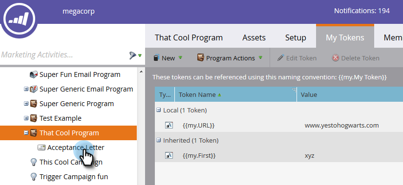
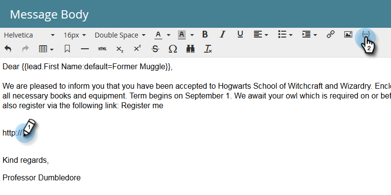

# Utilisation des URL dans Mes jetons {#using-urls-in-my-tokens}

Suivez les étapes ci-dessous pour utiliser Mes jetons pour insérer des URL dans vos courriels.

1. Sélectionnez votre programme et cliquez sur **Mes jetons**.

   

1. Sélectionnez le **Texte** Mon jeton, faites-le glisser sur la trame.

   

1. Attribuez un nom unique au jeton, saisissez une URL (sans le http://) et cliquez sur **Enregistrer**.

   

   >[!CAUTION]
   >
   >Pour vous assurer que les clics sont suivis dans votre courrier électronique, **ne pas** entrez http:// dans la valeur du jeton.

1. Sélectionnez le courriel dans votre programme.

   

1. Cliquez sur **Modifier le brouillon**.

   

1. Cliquez doublon dans la zone de texte à modifier.

   

1. N&#39;importe où dans votre courrier électronique, tapez &quot;http://&quot; (sans laisser d&#39;espace après) et cliquez sur l&#39;icône Insérer un jeton.

   

   >[!NOTE]
   >
   >Bien sûr, vous avez également la possibilité d&#39;entrer &quot;https&quot; si votre site l&#39;utilise.

1. Recherchez votre jeton, sélectionnez-le, puis cliquez sur **Insérer**.

   

1. Mettez en surbrillance http:// et jeton, puis appuyez sur Ctrl/Cmd+X (Ctrl = Windows/Cmd = Mac) pour couper le texte.

   

1. Mettez en surbrillance le texte que vous souhaitez que le lien s’affiche, puis cliquez sur l’icône Insérer/Modifier le lien.

   

1. Appuyez sur Ctrl/Cmd+V pour coller le contenu dans la zone **URL** et cliquez sur **Insérer**.

   

1. Cliquez sur **Enregistrer**.

   

   Et vous avez fini ! Votre URL sera renseignée après l’envoi et, si vous placez http:// devant le jeton, il produira un lien pouvant faire l’objet d’un suivi.

