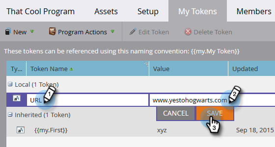

# Utilisation d’URL dans mes jetons {#using-urls-in-my-tokens}

Suivez les étapes ci-dessous pour utiliser Mes jetons afin d’insérer des URL dans vos e-mails.

1. Sélectionnez votre programme et cliquez sur **Mes jetons**.

   

1. Sélectionnez le **Texte** Mon jeton, faites-le glisser et déposez-le sur la zone de travail.

   

1. Attribuez un nom unique au jeton, saisissez une URL (sans le champ https://) et cliquez sur **Enregistrer**.

   

   >[!CAUTION]
   >
   >**Utilisation de http/https...**
   >
   >* Pour vous assurer que les clics sont suivis dans votre e-mail, ne saisissez **pas** https:// _à l’intérieur_ la valeur du jeton. Utilisez-le en dehors du jeton, comme indiqué à l’étape 7.
   >
   >* Nous vous recommandons vivement de ne pas exclure le http/https. Si vous le faites, la [version web](/help/marketo/product-docs/email-marketing/general/functions-in-the-editor/add-a-view-as-web-page-link-to-an-email.md){target="_blank"} de votre e-mail risque de s’afficher incorrectement.

1. Sélectionnez l’e-mail dans votre programme.

   

1. Cliquez sur **Modifier le brouillon**.

   

1. Double-cliquez dans la zone de texte pour modifier.

   

1. N’importe où dans votre e-mail, saisissez `https://` (sans laisser d’espace après), puis cliquez sur l’icône Insérer un jeton .

   

   >[!NOTE]
   >
   >Vous avez bien sûr également la possibilité de saisir des `http://` si votre site n’utilise pas https.

1. Recherchez votre jeton Mon jeton, sélectionnez-le, puis cliquez sur **Insérer**.

   

1. Mettez en surbrillance le jeton https:// et , puis appuyez sur Ctrl/Cmd+X (Ctrl = Windows/Cmd = Mac) pour couper le texte.

   

1. Mettez en surbrillance le texte que le lien doit afficher et cliquez sur l’icône Insérer/Modifier le lien .

   

1. Appuyez sur Ctrl/Cmd+V pour coller le contenu dans la zone **URL**, puis cliquez sur **Insérer**.

   

1. Cliquez sur **Enregistrer**.

   

   Et c&#39;est fini ! Votre URL sera renseignée après l’envoi, et grâce à votre placement de https:// devant le jeton, un lien trackable sera généré.
