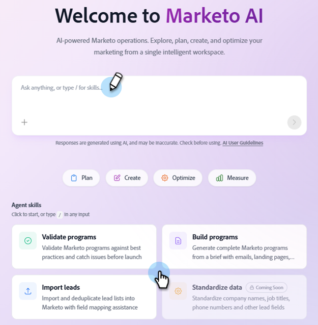

# Présentation de Marketo AI {#overview}

L’IA dédiée à Marketo fournit des compétences d’agent conçues pour automatiser les fonctions marketing longues mais importantes.

>[!AVAILABILITY]
>
>Cette fonctionnalité est actuellement en version Beta ouverte. Pour demander l’accès, contactez votre gestionnaire de compte. Vous devez également accepter les termes [ Core Gen-AI et les termes supplémentaires](https://www.adobe.com/legal/terms/enterprise-licensing/genai-ww.html){target="_blank"}. Actuellement, l’IA dédiée à Marketo est uniquement optimisée pour l’anglais.

>[!IMPORTANT]
>
>* Une fois que l’IA dédiée à Marketo a été activée pour votre abonnement, vous devez effectuer certaines [étapes de configuration](/help/marketo/product-docs/marketo-ai/settings-setup.md){target="_blank"} pour vous assurer que les utilisateurs souhaités ont accès.
>
>* Examinez la portée des données, les contrôles de gouvernance et les considérations relatives aux informations d’identification personnelles dans la [fiche d’informations sur les données](/help/marketo/product-docs/marketo-ai/data-information.md){target="_blank"} de l’IA dédiée à Marketo.

## Comment y accéder {#access}

Sur votre écran Mon Marketo, cliquez sur la mosaïque **Marketo AI**.

Saisissez votre demande dans le champ d’invite ou sélectionnez l’un des agents ci-dessous.

## Compétences {#skills}

La console centrale dispose d’un ensemble croissant de compétences d’agent disponibles pour vous aider à effectuer diverses tâches. Chaque compétence est un assistant d’IA personnalisé avec lequel vous interagissez en langage naturel pour terminer une tâche spécifique.

### Enquête sur les prospects {#investigate-leads}

Découvrez pourquoi une personne/un prospect spécifique n’a pas atteint un jalon (comme MQL, qualification d’un programme ou une campagne) et obtenez une explication en langage clair de ce qui s’est passé. En savoir plus sur la compétence [Enquêter sur les prospects](/help/marketo/product-docs/marketo-ai/skills/investigate-leads.md){target="_blank"}.

### Connaissances du produit {#product-knowledge}

La connaissance des produits vous donne un accès à la demande à l’expertise de Marketo sans quitter la plateforme. Posez une question en langage clair et l’IA dédiée à Marketo s’appuie sur la documentation officielle d’Adobe pour y répondre. En savoir plus sur la [compétence de connaissance du produit](/help/marketo/product-docs/marketo-ai/skills/product-knowledge.md){target="_blank"}.

### Valider les programmes {#validate-programs}

L’option Valider les programmes vérifie automatiquement votre configuration par rapport aux bonnes pratiques de Marketo et recherche les problèmes avant le lancement. En savoir plus sur la compétence [ Valider les programmes ](/help/marketo/product-docs/marketo-ai/skills/validate-programs.md){target="_blank"}.

### Importer les leads {#import-leads}

Importez et dédupliquez des listes de prospects dans votre base de données Marketo Engage avec l’aide du mappage des champs. En savoir plus sur la compétence [ Importer des prospects ](/help/marketo/product-docs/marketo-ai/skills/import-leads.md){target="_blank"}.

## Bientôt disponible {#coming-soon}

D’autres agents conçus pour gérer le travail le plus répétitif et le plus chronophage seront bientôt disponibles, tels que :

* Diagnostiquer les raisons pour lesquelles un lead n’a pas appliqué MQL ou progresser tout au long du cycle de vie
* Générer des programmes Marketo Engage complets directement à partir d’un résumé de campagne.
* Et plus encore.

>[!MORELIKETHIS]
>
>Le [serveur Marketo Engage MCP](https://experienceleague.adobe.com/docs/marketo-developer/marketo/mcp-server.html){target="_blank"} fait office de pont entre votre assistant d’IA et Marketo Engage.
