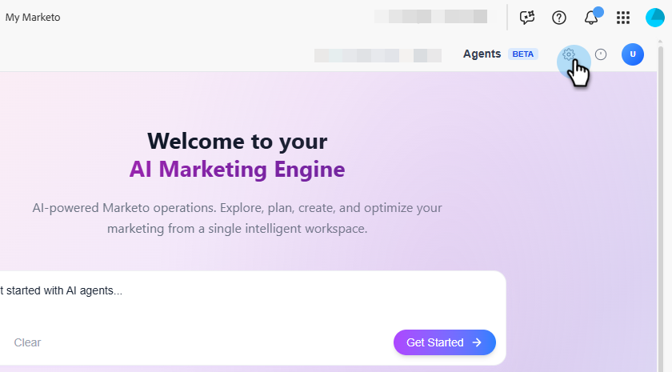

# Paramètres et configuration {#settings-setup}

Découvrez comment activer des autorisations et utiliser la zone Paramètres pour afficher les détails de connexion, définir des règles d’organisation et configurer des intégrations et des notifications.

>[!NOTE]
>
>Cette fonctionnalité est en version Beta ouverte et fait actuellement l’objet d’un déploiement échelonné au cours des prochains mois. Vous saurez quand il a été activé pour votre abonnement lorsque vous verrez une vignette _Créer avec l’IA_ sur votre écran Mon Marketo.

## Autorisations et rôles {#permission-and-role}

Il existe une autorisation _Accéder à la version avec IA_ et un rôle _Créer avec utilisateur AI_, qui permettent aux administrateurs et administratrices d’exercer un plus grand contrôle sur les utilisateurs et utilisatrices pouvant accéder à la fonctionnalité **Créer avec IA**. L’autorisation est affectée au niveau du rôle. Le rôle _Créer avec un utilisateur AI_ est fourni avec l’autorisation _Accéder à la création avec AI_ activée par défaut.

>[!IMPORTANT]
>
>L’autorisation _Accéder à la version avec IA_ n’est pas activée par défaut pour tous les rôles. Voir le tableau ci-dessous pour plus de détails.

| Rôle | Statut par défaut |
| --- | --- |
| Administration | Activé |
| Administrateur de produits Adobe | Activé |
| Utilisateur marketing | Désactivé |
| Utilisateur standard | Non disponible |
| Créer avec un utilisateur d’IA | Activé |
| Rôles personnalisés | Désactivé |

### Accéder à la version avec l’autorisation IA {#access-build-with-ai-permission}

Suivez les étapes ci-dessous pour activer _Access Build with AI_ pour les rôles qualifiés qui ne l’ont pas déjà activé.

1. Dans Mon Marketo, cliquez sur **Admin**, puis **Utilisateurs et rôles**.

   

1. Dans l’onglet _Rôles_, sélectionnez le rôle souhaité, puis cliquez sur **Modifier le rôle**.

   

1. Faites défiler vers le bas et cochez la case _Accéder à la version avec IA_, puis cliquez sur **Enregistrer**.

   

   >[!NOTE]
   >
   >Vous pouvez suivre les mêmes étapes pour supprimer l’autorisation en **décochant** la case _Accéder à la version avec l’IA_.

### Créer avec le rôle d’utilisateur d’IA {#build-with-ai-user-role}

Pour affecter un utilisateur spécifique au rôle _Créer avec un utilisateur AI_, procédez comme suit.

>[!NOTE]
>
>Ce rôle **uniquement** contient l’autorisation _Accéder à la version avec IA_.

1. Dans Mon Marketo, cliquez sur **Admin**, puis **Utilisateurs et rôles**.

   

1. Sélectionnez l’utilisateur souhaité, puis cliquez sur **Modifier l’utilisateur**.

   

1. Dans _Rôles et espaces de travail_, cochez la case _Créer avec un utilisateur IA_. Si vous disposez de plusieurs espaces de travail, vous pouvez spécifier ceux auxquels accéder dans le menu déroulant du signe **+**. Cliquez sur **Enregistrer** lorsque vous avez terminé.

   

### Rôle personnalisé {#custom-role}

Vous avez également la possibilité de [créer un nouveau rôle](https://experienceleague.adobe.com/en/docs/marketo/using/product-docs/administration/users-and-roles/create-delete-edit-and-change-a-user-role#create-a-role){target="_blank"} et de personnaliser ses autorisations, en ajoutant _Accéder à la version avec IA_, ainsi que tout ce que vous souhaitez, et [en attribuant ce rôle](https://experienceleague.adobe.com/en/docs/marketo/using/product-docs/administration/users-and-roles/managing-user-roles-and-permissions#assign-roles-to-a-user){target="_blank"} à des utilisateurs spécifiques.

## Paramètres {#settings}

1. Dans Mon Marketo, cliquez sur la mosaïque **Créer avec l’IA**.

   

1. Cliquez sur l’icône d’engrenage.

   

### Connexion {#connection}

Cet onglet ne contient pas de champs modifiables. Il affiche des informations sur votre compte, telles que votre Munchkin ID et votre organisation IMS.

### Règles d&#39;organisation {#organizational-rules}

Définissez les directives et contraintes organisationnelles que l’IA dédiée à Marketo suit lors de la création ou de la modification de ressources Marketo Engage.

{width="800" zoomable="yes"}

>[!NOTE]
>
>Les règles utilisent le format Markdown avec le frontMATTER YAML. Les règles globales s’appliquent à tous les espaces de travail. Les règles de Workspace remplacent les paramètres globaux.

### Intégrations (bientôt disponibles) {#integrations}

Configurez les connexions aux services externes et aux API.

_Cet onglet peut apparaître dans l’interface utilisateur, mais il n’est pas encore disponible. Consultez les mises à jour_.

### Notifications (bientôt disponible) {#notifications}

Gérez les préférences des alertes et les canaux de notification.

_Cet onglet peut apparaître dans l’interface utilisateur, mais il n’est pas encore disponible. Consultez les mises à jour_.
