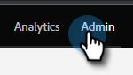
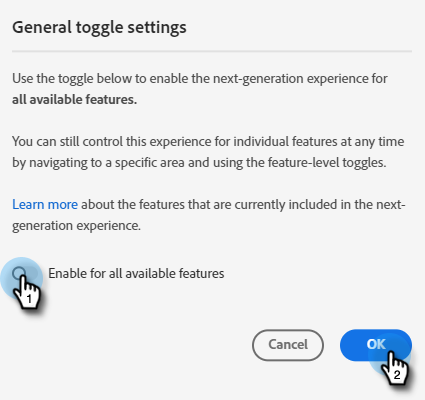

# Bouton (bascule) {#toggle-switch}

Le bouton (bascule) vous permet de basculer entre l’interface classique de Marketo et l’expérience d’utilisation moderne. Il est disponible dans toutes les zones mises en surbrillance ci-dessous.

>[!NOTE]
>
>Lorsque le bouton (bascule) est sélectionné, tous les workflows existants sont enregistrés automatiquement avant que le changement d’interface d’utilisation n’ait lieu. Si une opération est déjà en cours (par exemple, une ressource est en cours d’approbation), un message d’erreur en ce sens s’affiche et vous devez réessayer une fois l’opération terminée.

## Activer le bouton (bascule) pour des rôles individuels {#enable-the-toggle-switch-for-individual-roles}

Activez le bouton (bascule) pour des rôles individuels ou tous les rôles. Voici comment faire.

1. Dans Marketo Engage, cliquez sur **[!UICONTROL Admin]**.

   

1. Cliquez sur **[!UICONTROL Nouvelle expérience]**.

   

1. Sélectionnez le ou les rôles qui doivent avoir accès au bouton (bascule).

   

## Activer pour des fonctionnalités {#enable-for-features}

Vous avez la possibilité d’activer manuellement l’expérience d’utilisation moderne de Marketo Engage pour certaines fonctionnalités, ou pour toutes les fonctionnalités disponibles (actuelles et futures).

Dans une zone où se trouve actuellement le bouton (bascule) (dans cet exemple, nous sommes dans la vue Liste d’e-mails), cliquez simplement sur le bouton (bascule) en bas à droite de la page.

La nouvelle expérience se charge.

Pour l’activer pour _toutes_ les fonctionnalités, cliquez sur l’icône de roue dentée en regard du bouton (bascule).

Sélectionnez **[!UICONTROL Activer pour toutes les fonctionnalités disponibles]**, puis cliquez sur **[!UICONTROL OK]**.

## Fonctionnalités disponibles {#available-features}

Les fonctionnalités suivantes sont actuellement disponibles dans l’expérience d’utilisation moderne (de nouvelles fonctionnalités sont ajoutées à chaque version) :

* Vue Détails de l’e-mail
* Vue Liste d’e-mails
* Vue Détails du modèle d’e-mail
* Liste de modèles d’e-mail
* Vue Tableau de bord de test des e-mails
* Vue Détails du formulaire
* Vue Liste de formulaires
* Page Détails des images et des fichiers
* Vue Détails de la page de destination
* Vue Liste de pages de destination
* Détails du modèle de page de destination
* Liste de modèles de page de destination
* Vue Détails de l’extrait
* Vue Liste d’extrait
