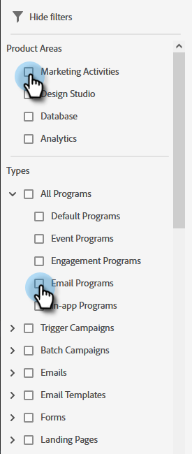

# Utilisation de la recherche globale {#using-the-global-search}

La puissante recherche globale vous offre de nombreuses options sans limite sur les résultats affichés.

## Exécution d’une recherche {#performing-a-search}

1. Dans la navigation globale, cliquez sur l’icône de recherche.

   

1. Saisissez le texte d’identification de votre ressource.

   

1. Les résultats de la recherche s’affichent. Vous pouvez cliquer n’importe où dans un chemin de navigation pour accéder directement à cet élément.

   

1. Dans cet exemple, nous choisissons d&#39;être directement redirigé vers l&#39;email que nous recherchons. Cliquez sur le nom de l&#39;email.

   

Vous êtes directement dirigé vers l’e-mail souhaité.

## Page Résultats de la recherche {#search-results-page}

<table> 
 <tbody>
  <tr>
   <td>1</td> 
   <td>Nom de l’élément/de la destination</td> 
  </tr>
  <tr>
   <td>2</td> 
   <td>Chemin (chemins de navigation) vers l’élément/la destination respectifs</td> 
  </tr>
  <tr>
   <td>3</td> 
   <td>Date et heure de la dernière modification de l’élément/de la destination</td> 
  </tr>
  <tr>
   <td>4</td> 
   <td>Date et heure de création de l’élément/de la destination</td> 
  </tr>
  <tr>
   <td>5</td> 
   <td>Mise en oeuvre de filtres ciblés pour limiter les résultats de la recherche</td> 
  </tr>
 </tbody>
</table>

**ÉTAPE FACULTATIVE** : Pour utiliser le filtrage, sélectionnez simplement les options souhaitées.

