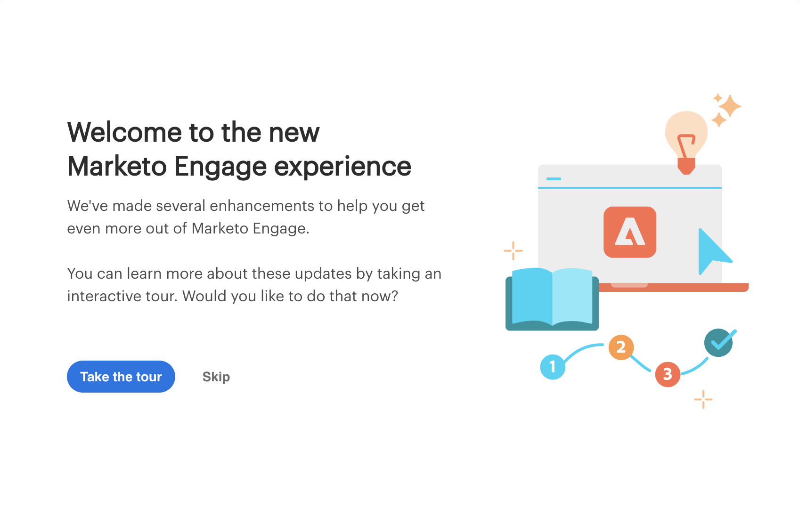

# APERÇU {#overview}

Bienvenue dans l&#39;expérience Marketo Engage de nouvelle génération, une nouvelle interface qui offre une utilisation améliorée ainsi qu&#39;une nouvelle apparence sur la plate-forme Marketo.

>[!PREREQUISITES]
>
>Si votre équipe informatique restreint l’accès au Web à l’aide d’une liste autorisée, demandez-lui d’ajouter les domaines suivants (y compris l’astérisque) pour autoriser toutes les ressources et les websockets Marketo :
>
>* *.marketo.com
>* *.marketodesigner.com
>* *.mktoweb.com

## Prendre le tour {#take-the-tour}

Lors de la première connexion, une fenêtre contextuelle s’affiche, prête à vous donner le résumé de la nouvelle expérience. En tête, si vous choisissez de l’ignorer, **pas** sera disponible ultérieurement.

Le tour vous guide à travers tout ce que vous avez besoin de savoir !

## Quoi de neuf ?{#whats-new}

Cette expérience de nouvelle génération comprend de nombreuses nouvelles fonctionnalités, toutes conçues pour améliorer de manière significative votre expérience marketing.

**Icônes**

La nouvelle interface présente une iconographie améliorée et développée. En savoir plus ici : [Nouveau glossaire des icônes](/help/marketo/product-docs/marketo-engage-next-generation-experience/new-icon-glossary.md).

**Navigation globale**

Au revoir le super-bal. Vous avez maintenant un accès rapide à toutes les principales sections de Marketo.

**URL d’instance**

Vous avez également un accès rapide à votre ID de serviette, qui se reflète désormais dans l’URL de votre instance (ce qui s’avère encore plus utile pour les personnes ayant plusieurs abonnements).

## Nouvelles options d&#39;arborescence {#new-tree-options}

Il y a une tonne de nouvelles fonctions d&#39;arbre disponibles.

**Marketo Classic contre le nouveau Marketo**

<table> 
 <tbody>
  <tr>
   <th>Fonctionnalité</th> 
   <th>Classique</th> 
   <th>Nouvelle génération</th> 
  </tr>
  <tr>
   <td>Application simultanée de plusieurs filtres</td> 
   <td></td> 
   <td><strong>X</strong></td>  
  </tr>
  <tr>
   <td>Noeud d'arborescence de brouillon et d'approbation combiné</td> 
   <td></td> 
   <td><strong>X</strong></td> 
  </tr>
  <tr>
   <td>Création de fichiers locaux dans des dossiers de programme</td> 
   <td></td> 
   <td><strong>X</strong></td> 
  </tr>
  <tr>
   <td>Doublon-clic pour développer/réduire les noeuds d'arborescence</td> 
   <td><strong>X</strong></td> 
   <td><strong>X</strong></td>  
  </tr>
  <tr>
   <td>Glisser-déposer de l’arborescence au flux d’engagement</td> 
   <td><strong>X</strong></td> 
   <td></td> 
  </tr>
  <tr>
   <td>Faire glisser et déposer dans l’arborescence</td> 
   <td><strong>X</strong></td> 
   <td><strong>X</strong></td> 
  </tr>
  <tr>
   <td>Filtrage par type de fichier et états</td> 
   <td><i>partiel</i></td> 
   <td><strong>X</strong></td>  
  </tr>
  <tr>
   <td>Mettre en surbrillance l'arrière-plan pour afficher la hiérarchie dans l'état ciblé</td> 
   <td></td> 
   <td><strong>X</strong></td> 
  </tr>
  <tr>
   <td>Mise en surbrillance des mots-clés pendant la recherche</td> 
   <td></td> 
   <td><strong>X</strong></td> 
  </tr>
  <tr>
   <td>Défilement horizontal</td> 
   <td><strong>X</strong></td> 
   <td><strong>X</strong></td>  
  </tr>
  <tr>
   <td>État de survol des noeuds d’arborescence</td> 
   <td><strong>X</strong></td> 
   <td><strong>X</strong></td> 
  </tr>
  <tr>
   <td>Réduire rapidement l'arborescence entière</td> 
   <td></td> 
   <td><strong>X</strong></td> 
  </tr>
  <tr>
   <td>Réduire rapidement le noeud racine</td> 
   <td></td> 
   <td><strong>X</strong></td>  
  </tr>
  <tr>
   <td>Mise à jour en temps réel</td> 
   <td></td> 
   <td><strong>X</strong></td> 
  </tr>
  <tr>
   <td>Arbre redimensionnable</td> 
   <td><strong>X</strong></td> 
   <td><strong>X</strong></td> 
  </tr>
  <tr>
   <td>Recherche dans les dossiers archivés</td> 
   <td></td> 
   <td><strong>X</strong></td>  
  </tr>
  <tr>
   <td>Chaîne de recherche enregistrée lors de la saisie d'une recherche globale à partir d'une recherche dans l'arborescence</td> 
   <td></td> 
   <td><strong>X</strong></td> 
  </tr>
  <tr>
   <td>Afficher tous les espaces de travail dans une seule arborescence</td> 
   <td><strong>X</strong></td> 
   <td><strong>X</strong></td> 
  </tr>
  <tr>
   <td>Balise d’état et info-bulles</td> 
   <td></td> 
   <td><strong>X</strong></td>  
  </tr>
  <tr>
   <td>Logique de recherche "débuts Word avec"</td> 
   <td><strong>X</strong></td> 
   <td><strong>X</strong></td> 
  </tr>
 </tbody>
</table>

## Navigation globale {#global-nav}

Jetez un coup d&#39;oeil au nouveau Global Nav.

<table> 
 <tbody>
  <tr>
   <td>1</td> 
   <td>Plus de liste déroulante de superball</td> 
  </tr>
  <tr>
   <td>2</td> 
   <td>Tous les éléments de superball précédents répertoriés</td> 
  </tr>
  <tr>
   <td>3</td> 
   <td>Utilisez cette option pour fournir des commentaires sur votre expérience MEUE</td> 
  </tr>
  <tr>
   <td>4</td> 
   <td>Si vous avez plusieurs abonnements, cliquez sur votre sous-nom pour passer facilement à un autre.</td> 
  </tr>
  <tr>
   <td>5</td> 
   <td>Recherche globale : vous pouvez désormais rechercher l’instance entière à partir d’ici</td> 
  </tr>
 </tbody>
</table>

>[!NOTE]
>
>Tout ce qui vivait dans la liste déroulante des super-balles est toujours disponible en tant que carreaux dans votre My Marketo.

>[!TIP]
>
>L&#39;utilisation de la recherche dans l&#39;arborescence ne produira que les résultats de la section que vous utilisez (par exemple, Activités marketing). Si vous souhaitez effectuer une recherche sur l’intégralité de votre instance, utilisez la recherche globale.

Profitez de la nouvelle expérience des Marketo Engage et n&#39;oubliez pas de partager vos commentaires !
