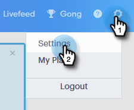

# Verrouillage du contenu {#content-lockdown}

En activant le verrouillage du contenu, empêchez les utilisateurs non-administrateurs de modifier des modèles et/ou des campagnes. Les utilisateurs ne pourront pas : partager, cloner, modifier ou supprimer du contenu. Ils n’auront pas non plus la possibilité d’archiver des modèles.

>[!NOTE]
>
>Les utilisateurs **pourront toujours** modifier le contenu d’un courrier électronique au moment de l’envoi ou lors du lancement d’une campagne.

1. Dans Sales Connect, cliquez sur l&#39;icône Paramètres et sélectionnez **Paramètres**.

   

1. Sous Paramètres d’administration, cliquez sur **Général**.

   

1. Faites défiler l’écran jusqu’à la section Verrouillage du contenu. L&#39;activation de l&#39;un ou l&#39;autre curseur _désactive_ la capacité des membres de votre équipe à créer/modifier des modèles et/ou des campagnes.

   
