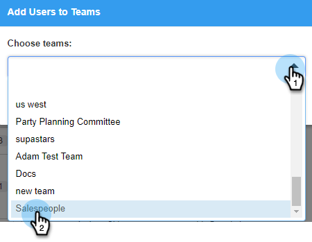

# Créer une sous-équipe {#create-a-sub-team}

## Créer une sous-équipe {#create-a-sub-team-1}

1. Cliquez sur l’icône d’engrenage et sélectionnez **[!UICONTROL Paramètres]**.

   

1. Sous [!UICONTROL Paramètres d’administration], sélectionnez **[!UICONTROL Gestion de l’équipe]**.

   

1. En regard de [!UICONTROL Toutes les équipes], cliquez sur le signe **+**.

   

1. Saisissez un nom d’équipe (et une description facultative) et cliquez sur **[!UICONTROL Créer]**.

   

   >[!NOTE]
   >
   >Vous pouvez désormais partager des modèles, des campagnes et des groupes avec cette équipe.

## Ajouter des personnes à votre sous-équipe {#add-people-to-your-sub-team}

1. Toujours en [!UICONTROL Gestion d’équipe], sélectionnez le groupe **[!UICONTROL Tout le monde]**.

   

1. Recherchez les utilisateurs que vous souhaitez ajouter à votre sous-équipe et cochez leur case.

   

1. Cliquez sur **[!UICONTROL Ajouter la sélection aux équipes]**.

   

1. Cliquez sur la liste déroulante et sélectionnez la ou les équipes de votre choix.

   

1. Cliquez sur **[!UICONTROL Ajouter aux équipes]** lorsque vous avez terminé.

   
