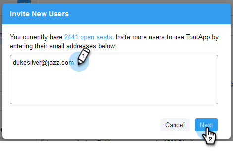

# Inviter des membres de l’équipe {#invite-team-members}

Ajouter les membres de l&#39;équipe est rapide et facile !

1. Cliquez sur l’icône d’engrenage et sélectionnez **Paramètres**.

   

1. Sous Paramètres d’administration, sélectionnez Gestion **** d’équipe.

   

1. Cliquez sur **Inviter un nouvel utilisateur**.

   

1. Entrez les adresses électroniques des personnes que vous souhaitez ajouter, puis cliquez sur **Suivant**.

   

   >[!NOTE]
   >
   >Par défaut, tous les nouveaux membres seront ajoutés à l’équipe Tout le monde.

1. Cliquez sur **OK**.

   

