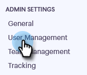

# Inviter des utilisateurs {#invite-users}

L’ajout d’utilisateurs est simple et rapide.

1. Cliquez sur l’icône d’engrenage et sélectionnez **[!UICONTROL Paramètres]**.

   

1. Sous [!UICONTROL Paramètres d’administration], sélectionnez **[!UICONTROL Gestion des utilisateurs]**.

   

1. Cliquez sur **[!UICONTROL Inviter des utilisateurs]**.

   

1. Saisissez les adresses e-mail des personnes à ajouter, puis cliquez sur **[!UICONTROL Suivant]**.

   

   >[!NOTE]
   >
   >Par défaut, tous les nouveaux membres sont ajoutés à l’équipe Tout le monde.

1. Cliquez sur **[!UICONTROL OK]**.

   
