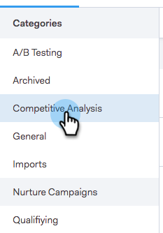

# Paramètres de partage {#sharing-settings}

Gérez mieux vos modèles en limitant ce que les utilisateurs peuvent partager et avec quelles catégories.

Lorsque votre compte Sales Connect est créé pour la première fois, les paramètres de partage sont activés. Cela permet aux administrateurs de votre compte de créer et d’organiser vos catégories de modèles avant d’ouvrir les vannes et de permettre aux utilisateurs de partager du contenu dans les catégories de votre équipe.

Lorsque les paramètres de partage sont activés, seuls les administrateurs peuvent partager dans les catégories, sauf si des privilèges de partage sont fournis à une équipe ou à tout le monde. Les paramètres de partage étant désactivés, il n’y a aucune restriction et tous les utilisateurs peuvent partager dans n’importe quelle catégorie de modèle.

## Configurer vos paramètres de partage {#configure-your-sharing-settings}

1. Dans l’[application Web](http://toutapp.com/login), accédez à la page Paramètres.

   

1. Sous Paramètres d’administration, sélectionnez **Accès au partage**.

   

1. Vérifiez que **les paramètres de partage** sont activés. Cela signifie que, par défaut, seuls les administrateurs pourront partager des modèles dans vos catégories de modèles.

   

1. Sélectionnez la Catégorie de modèles à configurer.

   

1. Cliquez sur **Ajouter les équipes pour l&#39;accès**.

   

1. Sélectionnez les équipes à ajouter.

   

   >[!NOTE]
   >
   >Si vous ne voyez aucune équipe, vous devrez vous rendre à Team Management et créer une équipe d&#39;utilisateurs.

1. Cliquez sur **Ajouter les équipes pour Access** pour enregistrer.

   

1. Maintenant que votre équipe a été ajoutée, vous pouvez choisir d&#39;autoriser uniquement les administrateurs d&#39;équipe à partager ou tous les utilisateurs de cette équipe. Dans cet exemple, nous avons donné à tous les utilisateurs de l&#39;équipe DTS l&#39;accès de partage.

   

