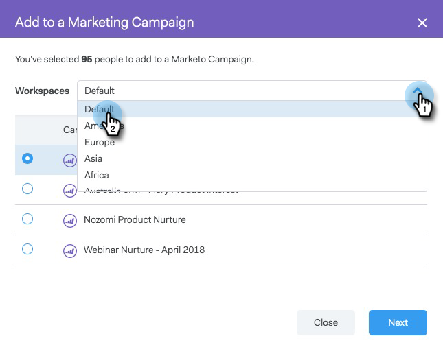

# Ajouter à la campagne marketing {#add-to-marketing-campaign}

>[!PREREQUISITES]
>
>[Rendre une campagne visible par les utilisateurs commerciaux](/help/marketo/product-docs/marketo-sales-connect/marketo/make-a-campaign-visible-to-sales-connect-users.md)

## Ajout d’individus à une campagne {#add-individuals-to-a-campaign}

>[!NOTE]
>
>Pour ajouter une personne à une campagne Marketo à partir de [!DNL Sales Connect], [!DNL Sales Connect] devez disposer de son ID de prospect Marketo.

1. Cliquez sur l’onglet **[!UICONTROL Personnes]**.

   

1. Recherchez le ou les contacts à ajouter.

   

1. Cochez la case pour sélectionner vos contacts.

   

1. Cliquez sur **[!UICONTROL Ajouter la sélection à la campagne]**.

   

1. Puisque vous effectuez un ajout à une campagne marketing, ignorez la sélection d’une adresse « De ». Vous pouvez toutefois choisir d’ajouter d’autres contacts. Si vous le souhaitez, cliquez sur **[!UICONTROL Individus]** et saisissez-les. Cliquez sur **[!UICONTROL Suivant]** lorsque vous avez terminé.

   

1. Cliquez sur **[!UICONTROL Campagne marketing]**.

   

1. Cliquez sur la liste déroulante [!UICONTROL Espaces de travail] et sélectionnez l’espace de travail contenant la campagne à laquelle vous souhaitez ajouter le groupe.

   

   >[!NOTE]
   >
   >Si vous ne voyez pas l’espace de travail souhaité, assurez-vous que votre administrateur l’a configuré via votre page d’accès de l’équipe Marketo.

1. Sélectionnez la campagne souhaitée et cliquez sur **[!UICONTROL Suivant]**.

   

1. On vous montre les contacts qui remplissent les critères. Cliquez sur **[!UICONTROL Démarrer]** pour les ajouter.

   

## Ajout d’un groupe à une campagne {#add-a-group-to-a-campaign}

1. Cliquez sur l’onglet **[!UICONTROL Personnes]**.

   

1. Sous [!UICONTROL Mes groupes], sélectionnez le groupe que vous souhaitez ajouter à une campagne.

   

1. Cliquez sur **[!UICONTROL Ajouter un groupe à la campagne]**.

   

1. Puisque vous effectuez un ajout à une campagne marketing, ignorez la sélection d’une adresse « De ». Vous pouvez toutefois choisir d’ajouter d’autres contacts. Si vous le souhaitez, cliquez sur **[!UICONTROL Individus]** et saisissez-les. Cliquez sur **[!UICONTROL Suivant]** lorsque vous avez terminé.

   

1. Sélectionnez **[!UICONTROL Campagne marketing]**.

   

   >[!NOTE]
   >
   >Pour ajouter une personne à une campagne Marketo à partir de [!UICONTROL Sales Connect], [!UICONTROL Sales Connect] doit disposer de l’ID de prospect Marketo de la personne.

1. Cliquez sur la liste déroulante **[!UICONTROL Espaces de travail]** et sélectionnez l’espace de travail contenant la campagne à laquelle vous souhaitez ajouter le groupe.

   

   >[!NOTE]
   >
   >Si vous ne voyez pas l’espace de travail souhaité, assurez-vous que votre administrateur l’a configuré via votre page d’accès de l’équipe Marketo.

1. Sélectionnez la campagne souhaitée et cliquez sur **[!UICONTROL Suivant]**.

   

1. On vous montre les contacts qui remplissent les critères. Cliquez sur **[!UICONTROL Démarrer]** pour les ajouter.

   
