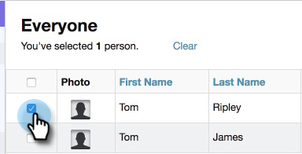
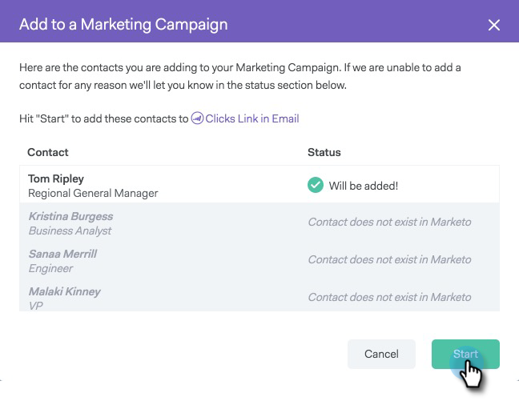

# Ajouter à Marketing Campaign {#add-to-marketing-campaign}

>[!NOTE]
>
>**Conditions préalables**
>
>[Rendre un Campaign visible pour les utilisateurs commerciaux](http://docs.marketo.com/x/NwDh)

## Ajouter des individus à un Campaign {#add-individuals-to-a-campaign}

>[!NOTE]
>
>Pour ajouter une personne à un Campaign Marketing à partir de Sales Connect, Sales Connect doit avoir son identifiant de piste Marketo. [Découvrez comment capturer les identifiants de marketing ici](http://docs.marketo.com/x/CQXLAQ).

1. Cliquez sur l’onglet **Personnes** .

   

1. Recherchez le ou les contacts que vous souhaitez ajouter.

   

1. Cochez la case pour sélectionner votre ou vos contacts.

   

1. Cliquez sur **Ajouter la sélection à Campaign**.

   

1. Puisque vous ajoutez une campagne marketing, ignorez la sélection d’une adresse &quot;de&quot;. Vous pouvez toutefois choisir d&#39;ajouter d&#39;autres contacts. Si vous le souhaitez, cliquez sur Individus et entrez-les dans le champ. Lorsque vous avez terminé, cliquez sur **Suivant** .

   

1. Cliquez sur **Marketing Campaign**.

   

1. Cliquez sur la liste déroulante Espaces de travail et choisissez l’espace de travail contenant la campagne à laquelle vous souhaitez ajouter le groupe.

   

   >[!NOTE]
   >
   >Si vous ne voyez pas l’espace de travail que vous souhaitez, assurez-vous que votre administrateur le provisionne via votre page Accès à l’équipe Marketing.

1. Sélectionnez la campagne de votre choix, puis cliquez sur **Suivant**.

   

1. Les contacts qualifiés s&#39;affichent. Cliquez sur **Début** pour les ajouter.

   

## Ajouter un groupe à un Campaign {#add-a-group-to-a-campaign}

1. Cliquez sur l’onglet **Personnes** .

   

1. Sous Mes groupes, sélectionnez le groupe que vous souhaitez ajouter à une campagne.

   

1. Cliquez sur **Ajouter le groupe à Campaign**.

   

1. Puisque vous ajoutez une campagne marketing, ignorez la sélection d’une adresse &quot;de&quot;. Vous pouvez toutefois choisir d&#39;ajouter d&#39;autres contacts. Si vous le souhaitez, cliquez sur Individus et entrez-les dans le champ. Lorsque vous avez terminé, cliquez sur **Suivant** .

   

1. Sélectionnez **Marketing Campaign**.

   

   >[!NOTE]
   >
   >Pour ajouter une personne à un Campaign Marketing à partir de Sales Connect, Sales Connect doit avoir son identifiant de piste Marketo. [Découvrez comment capturer les identifiants de marketing ici](http://docs.marketo.com/x/CQXLAQ).

1. Cliquez sur la liste déroulante Espaces de travail et choisissez l’espace de travail contenant la campagne à laquelle vous souhaitez ajouter le groupe.

   

   >[!NOTE]
   >
   >Si vous ne voyez pas l’espace de travail que vous souhaitez, assurez-vous que votre administrateur le provisionne via votre page Accès à l’équipe Marketing.

1. Sélectionnez la campagne de votre choix, puis cliquez sur **Suivant**.

   

1. Les contacts qualifiés s&#39;affichent. Cliquez sur **Début** pour les ajouter.

   

