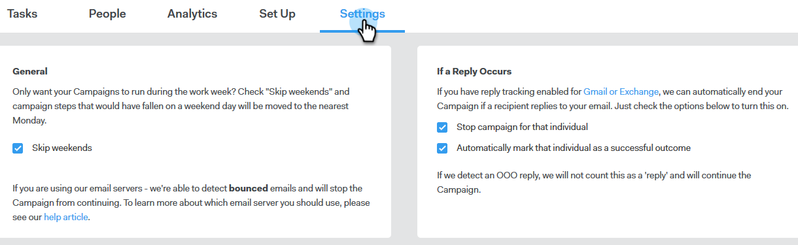

# Création d’une campagne {#create-a-campaign}

Les campagnes sont une série d’étapes multicanaux comprenant : emails, appels téléphoniques, InMail et tâches personnalisées. Elles vous permettent de rationaliser vos communications avec vos clients potentiels et existants.

Avec les campagnes, vous pouvez :

* **Organiser** : rationalisez toutes vos activités de sensibilisation en un seul endroit pour une exécution efficace.

* **Échelle** : planifiez tous vos efforts de sensibilisation afin de pouvoir réduire vos efforts, minimiser le travail manuel et personnaliser autant que nécessaire.
* **Mesure** : effectuez le suivi de la réussite de tous vos emails et tâches à un seul endroit tout en les connectant automatiquement à Salesforce. En sachant ce qui a de l’impact et conduit aux résultats, vous pouvez constamment tester et améliorer vos résultats.

Alors, comment configurer une campagne ?

1. Cliquez sur l’onglet **Campagnes** .

   

1. Sélectionnez une catégorie et cliquez sur le bouton **Créer une campagne** pour créer une campagne.

   

   >[!NOTE]
   >
   >Créez une nouvelle catégorie en cliquant sur **+** en regard de **Catégories**.

1. La catégorie choisie sera sélectionnée. Si vous changez d’avis, cliquez sur la liste déroulante et sélectionnez-en une autre. Une fois que vous avez terminé, cliquez sur **Continuer**.

   

1. Cliquez sur **Ajouter une étape**.

   

1. Choisissez entre : Email, Call, InMail ou Tâche personnalisée. Dans cet exemple, nous choisissons [Email](/help/marketo/product-docs/marketo-sales-connect/campaigns/campaign-step-types.md#email).

   

1. Une fois que vous avez créé votre première journée et votre première étape, le bouton &quot;Ajouter un jour&quot; est activé et vous pouvez ajouter autant de jours et d’étapes que le nécessite votre processus de vente.

   

   >[!NOTE]
   >
   >&quot;Jours&quot; ne sont pas le nombre de jours entre les actions, mais le jour dans la séquence. Par exemple, si votre campagne va durer 7 jours, la saisie de &quot;3&quot; signifie que l’action sera lancée le 3 du 7, **et non** 3 jours plus tard.

1. Veillez à personnaliser les options de planification et de réponse, comme sauter les week-ends (ce qui est génial) en consultant l’ **onglet Paramètres** de votre campagne.

   

   Il est maintenant temps d&#39;ajouter des personnes à votre campagne !
