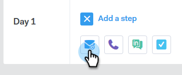

# Création d’une campagne {#create-a-campaign}

Les campagnes sont une série d’étapes multicanaux, notamment : e-mails, appels téléphoniques, InMail et tâches personnalisées. Ils vous permettent de rationaliser vos communications avec vos clients potentiels et existants.

Avec les campagnes, vous pouvez :

* **Organiser** : rationalisez toutes vos activités de sensibilisation en un seul endroit pour une exécution efficace.

* **Échelle** : planifiez tous vos efforts de sensibilisation afin de pouvoir échelonner vos efforts, réduire le travail manuel et personnaliser autant que nécessaire.
* **Mesure** : suivez le succès de tous vos e-mails et tâches au même endroit tout en les connectant automatiquement à [!DNL Salesforce]. En sachant ce qui résonne et donne des résultats, vous pouvez constamment tester et améliorer vos résultats.

Alors, comment configurer une campagne ?

1. Cliquez sur l’onglet **[!UICONTROL Campagnes]**.

   

1. Sélectionnez une catégorie et cliquez sur le bouton **[!UICONTROL Créer une campagne]** pour créer une campagne.

   

   >[!NOTE]
   >
   >Créez une catégorie en cliquant sur le **+** en regard de **[!UICONTROL Catégories]**.

1. La catégorie que vous avez choisie sera sélectionnée. Si vous changez d’avis, cliquez sur la liste déroulante et sélectionnez-en une autre. Lorsque vous avez terminé, cliquez sur **[!UICONTROL Continuer]**.

   

1. Cliquez sur **[!UICONTROL Ajouter une étape]**.

   

1. Choisissez entre : E-mail, Appel, InMail ou Tâche personnalisée. Dans cet exemple, nous choisissons [E-mail](/help/marketo/product-docs/marketo-sales-connect/campaigns/campaign-step-types.md#email).

   

1. Après avoir créé votre premier jour et votre première étape, le bouton « [!UICONTROL Ajouter un jour] » s’active et vous pouvez ajouter autant de jours et d’étapes que nécessaire pour votre processus de vente.

   

   >[!NOTE]
   >
   >Les « Jours » ne sont pas le nombre de jours entre les actions, mais le jour dans la séquence. Par exemple, si votre campagne doit durer 7 jours, la saisie de « 3 » signifie que l’action sortira le jour 3 de 7, **pas** 3 jours plus tard.

1. Veillez à personnaliser les options de planification et de réponse, telles que Ignorer les week-ends (ce qui est formidable) en consultant l’onglet **[!UICONTROL Paramètres]** pour votre campagne.

   

   Il est maintenant temps de commencer à ajouter des personnes à votre campagne.
