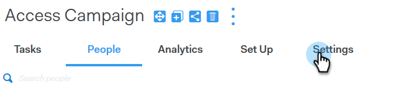

# Ignorer les week-ends {#skip-weekends}

Lors de l’automatisation d’une campagne, vous ne souhaitez probablement pas que vos e-mails soient envoyés un samedi ou un dimanche. Sinon, vous avez la possibilité de sauter les week-ends.

1. Dans [!DNL Sales Connect], cliquez sur l&#39;onglet **[!UICONTROL des campagnes]** .

   

1. Recherchez et sélectionnez votre campagne.

   

1. Cliquez sur **[!UICONTROL Paramètres]**.

   

1. Cochez la case **[!UICONTROL Ignorer les week-ends]**.

   

   >[!NOTE]
   >
   >Sans ignorer les week-ends, vos e-mails sont planifiés sur la base d’une semaine régulière de 7 jours.
