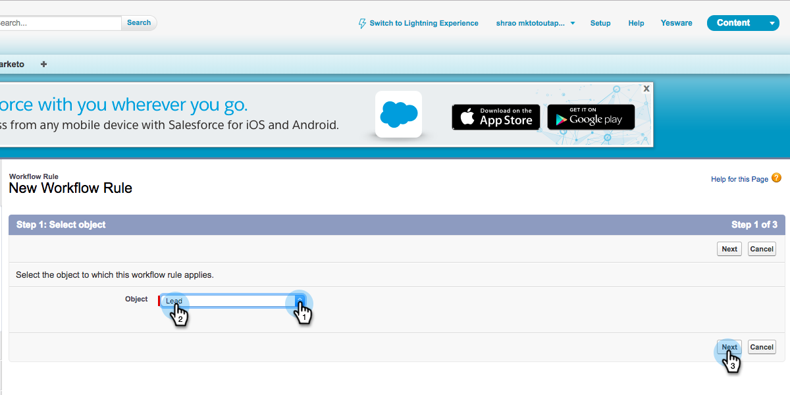
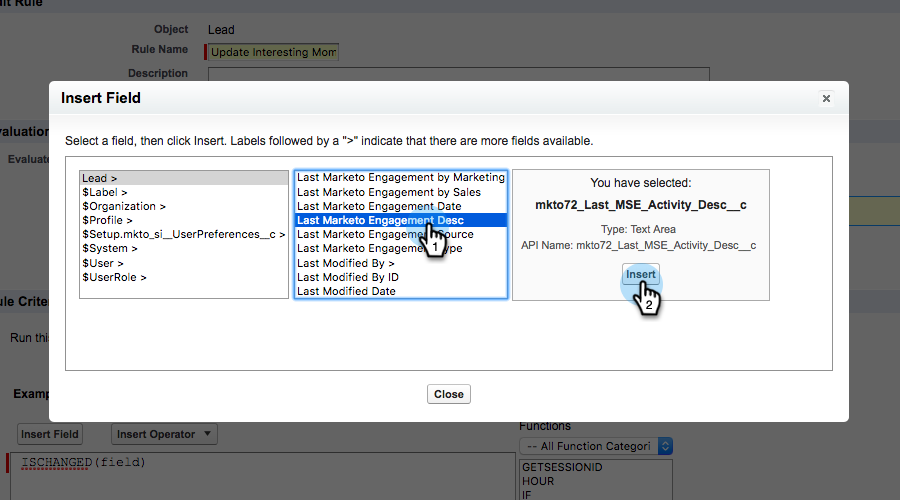

# Création de règles de processus dans Salesforce {#creating-workflow-rules-in-salesforce}

Lors de l&#39;utilisation de Marketing Sales Insight (MSI) et de Marketing Sales Connect (MSC) en parallèle, la fonction MSI Best Bets (Meilleurs paris) dans Salesforce ne sera pas mise à jour. Toutes les autres fonctions MSI fonctionnent comme d’habitude (affichage de moments intéressants dans l’iFrame, envoi d’e-mails, ajout à des campagnes, etc.). Cet article offre une solution pour que les meilleurs paris fonctionnent à nouveau.

>[!NOTE]
>
>Cela concerne uniquement les clients qui utilisent **à la fois** MSI et MSE et qui souhaitent utiliser la fonction Meilleurs paris de MSI. Si vous n’avez pas besoin/utilisez les meilleurs paris, vous pouvez ignorer.

## Prise en main {#getting-started}

La solution comprend la création de nouvelles règles de flux de travail pour copier des valeurs des nouveaux champs MSE dans les anciens champs MSI. Vous devez créer quatre règles de flux de travail pour l&#39;objet Contact et les quatre mêmes règles de flux de travail pour l&#39;objet Lead dans votre propre instance Salesforce. Pour ce faire, vous devrez peut-être disposer des droits d’administrateur CRM (selon votre rôle et votre configuration dans la gestion de la relation client).

Vous trouverez ci-dessous les noms recommandés des règles de flux de travail et la description de chacune d’elles. Elles s&#39;appliquent à l&#39;objet Contact et prospect :

<table> 
 <colgroup> 
  <col> 
  <col> 
 </colgroup> 
 <tbody> 
  <tr> 
   <td>Mettre à jour le champ de description du moment intéressant</td> 
   <td>
Copier de : Dernier DescCopy d'engagement marketing vers : Dernier moment intéressant Desc
</td> 
  </tr> 
  <tr> 
   <td>Mettre à jour le champ Type de moment intéressant</td> 
   <td>
Copier de : Dernier engagement marketing TypeCopy à : Dernier type de moment intéressant
</td> 
  </tr> 
  <tr> 
   <td>Mettre à jour le champ Source du moment intéressant</td> 
   <td>
Copier de : Dernier SourceCopy d'engagement marketing vers : Dernière source intéressante
</td> 
  </tr> 
  <tr> 
   <td>Mettre à jour le champ Date du moment intéressant</td> 
   <td>
Copier de : Dernier engagement marketing DateCopy à : Date du dernier moment intéressant
</td> 
  </tr> 
 </tbody> 
</table>

## Instructions {#instructions}

1. Après avoir cliqué sur **Configuration**, recherchez **Workflow** et sélectionnez Règles **de** Workflow.

   

1. Sélectionnez **Nouvelle règle**.

   

1. Cliquez sur la liste déroulante Objet et sélectionnez **Piste**, puis cliquez sur **Suivant**.

   

1. Saisissez &quot;Mettre à jour le champ Description du moment intéressant&quot; comme nom de la règle. Sélectionnez le bouton radio **créé et chaque fois qu’il est modifié**. Dans la liste déroulante Critères de règle, la **formule de sélection est évaluée sur true**. Recherchez et sélectionnez la fonction ISCHANGED. Ensuite, mettez en surbrillance la valeur de champ par défaut et cliquez sur **Insérer un champ**.

   

1. Dans la fenêtre contextuelle Insérer un champ, choisissez Desc **Dernier engagement marketing et cliquez sur** Insérer ****.

   

1. Cliquez sur **Enregistrer et suivant**.

   

1. Dans la liste déroulante Ajouter l’action de flux de travail, sélectionnez **Nouvelle mise à jour** des champs.

   

1. Dans le champ Name, saisissez &quot;Update intéressante Moment Desc Field&quot; (Nom unique généré automatiquement). Dans la liste déroulante Champ à mettre à jour, sélectionnez **Dernier moment intéressant**. Sélectionnez le bouton radio **Utiliser une formule pour définir une nouvelle valeur** , puis cliquez sur **Afficher l&#39;éditeur** de formule.

   

1. Cliquez sur le bouton **Insérer un champ** .

   

1. Sélectionnez Desc **** Dernier engagement marketing, puis cliquez sur **Insérer**. Dans la page suivante, cliquez sur **Enregistrer**.

   

1. Cliquez sur **Terminé**.

   

1. Cliquez sur **Activer** pour activer la règle de flux de travail.

   

   Après la dernière étape, vous pouvez choisir de cloner la règle de flux de travail pour les autres champs répertoriés dans la section Prise en main : Desc, Type, Source, Date. Une fois que vous avez terminé les quatre règles de flux de travail dans l&#39;objet Contact, répétez la même chose pour l&#39;objet Lead.

