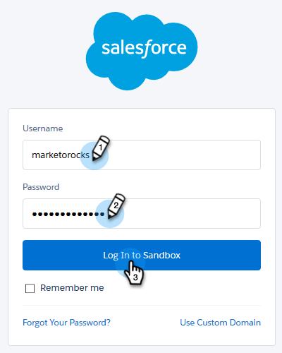

# Comment connecter les ventes à votre sandbox Salesforce {#how-to-connect-sales-connect-to-your-salesforce-sandbox}

>[!NOTE]
>
>**Conditions préalables**
>
>Votre compte Sales Connect ne peut pas être déjà connecté à Salesforce lors de l&#39;établissement d&#39;une connexion au sandbox. Si tel est le cas, [veillez à vous déconnecter](http://docs.marketo.com/x/FoDq) avant de suivre les étapes décrites dans cet article.

1. Dans Sales Connect, cliquez sur l&#39;icône représentant un engrenage dans l&#39;angle supérieur droit et sélectionnez **Paramètres**.

   

1. Sous Intégrations, cliquez sur **CRM**.

   

1. Dans la carte Salesforce, cliquez sur **Plus d&#39;infos**.

   

1. Au bas de la page, cliquez sur **Se connecter à Sandbox**.

   

   >[!NOTE]
   >
   >Si vous êtes déjà connecté à votre compte Salesforce Sandbox, vous serez dirigé vers une page Autorisation où vous devrez autoriser l&#39;accès. Si vous n’êtes pas encore connecté, passez à l’étape 5.

1. Entrez le nom d&#39;utilisateur et le mot de passe de votre compte Salesforce Sandbox.

   

>[!NOTE]
>
>**Articles connexes**
>
>[Comment installer des personnalisations dans votre sandbox Salesforce](http://docs.marketo.com/x/EIDq)

