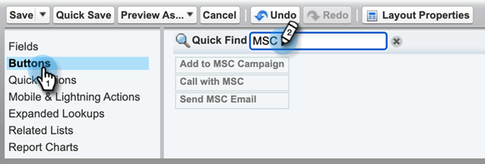
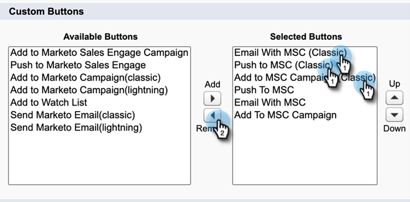

# Désinstaller Marketo Sales Connect de Salesforce Classic {#uninstall-marketo-sales-connect-from-salesforce-classic}

Voici comment désinstaller le package Marketo Sales Connect de votre compte Salesforce une fois que vous avez commencé à utiliser les actions Sales Insight.

## Supprimer les champs [!DNL Sales Connect] de la mise en page {#remove-sales-connect-fields-from-page-layout}

1. Dans [!DNL Salesforce] Classic, cliquez sur **[!UICONTROL Configuration]**.

   

1. Dans le volet de navigation de gauche, sous [!UICONTROL Créer], développez (sans cliquer sur) [!UICONTROL Personnaliser], puis [!UICONTROL Leads]. Sélectionnez ensuite **[!UICONTROL Mises en page]**.

   

1. Cliquez sur **[!UICONTROL Modifier]** en regard de la disposition des leads.

   

1. Dans la console, sélectionnez **[!UICONTROL Champs]**. Dans Recherche rapide, recherchez « MSC ». Tous les champs grisés ont été ajoutés à votre mise en page. Vous devrez les supprimer.

   

   >[!NOTE]
   >
   >Si aucun des champs n’est grisé, cela signifie que vous ne les avez pas ajoutés à votre mise en page. Vous pouvez ignorer cette section.

1. Faites défiler l’écran jusqu’à la section contenant vos [!DNL Sales Connect] champs personnalisés .

   

1. Il existe 10 types de champs MSC qui peuvent être ajoutés à cette section. Supprimez tous les champs que vous avez ajoutés ou supprimez simplement la section entière.

1. Cliquez sur **[!UICONTROL Enregistrement rapide]** lorsque vous avez terminé.

   

## Supprimer les boutons [!DNL Sales Connect] des mises en page {#remove-sales-connect-buttons-from-page-layouts}

1. Dans la console (étape 4 ci-dessus), sélectionnez **[!UICONTROL Boutons]**. Recherchez « MSC ». Tous les boutons grisés ont été ajoutés à la section de votre bouton personnalisé. Vous devrez les supprimer.

   

   >[!NOTE]
   >
   >Si aucun des boutons n’est grisé, cela signifie que vous ne les avez pas ajoutés. Vous pouvez ignorer cette section.

1. Effectuez un glisser-déposer des boutons MSC de la section [!UICONTROL Boutons personnalisés] vers la console.

   

1. Cliquez sur **[!UICONTROL Enregistrement rapide]** lorsque vous avez terminé.

   

## Supprimez [!DNL Sales Connect] champs de la section [!UICONTROL Historique des activités]. {#remove-sales-connect-fields-from-activity-history-section}

1. Faites défiler la page jusqu’au bas, dans la section de liste associée [!UICONTROL Historique des activités], puis cliquez sur l’icône Clé à molette.

   

1. Sélectionnez les champs [!DNL Sales Connect] dans la zone [!UICONTROL Champs sélectionnés], puis cliquez sur la flèche [!UICONTROL Supprimer]. Cliquez sur **[!UICONTROL OK]** lorsque vous avez terminé.

   

   >[!NOTE]
   >
   >L’abréviation MSE _is_ [!DNL Sales Connect]. Il s’agit simplement du nom précédent, « Engagement commercial de Marketo ».

1. Cliquez sur **Enregistrer** lorsque vous avez fini d’utiliser la page Prospects.

## Supprimer [!DNL Sales Connect] boutons d’action en bloc de la vue Liste de leads {#remove-sales-connect-bulk-action-buttons-from-lead-list-view}

1. Dans le volet de navigation de gauche, sous [!UICONTROL Créer], développez (sans cliquer sur) [!UICONTROL Personnaliser], puis [!UICONTROL Leads]. Sélectionnez ensuite **[!UICONTROL Rechercher des mises en page]**.

   

1. En regard de la vue Liste des prospects, cliquez sur **[!UICONTROL Modifier]**.

   

1. Sélectionnez **[!UICONTROL Ajouter à MSC Campaign (Classic)]**, **[!UICONTROL E-mail avec MSC (Classic)]** et **[!UICONTROL Pousser vers MSC (Classic)]**, puis cliquez sur la flèche [!UICONTROL Supprimer]. Cliquez ensuite sur **[!UICONTROL Enregistrer]**.

   

Vous ne devriez plus voir les boutons dans la vue Liste de prospects.

## Supprimer la configuration MSC pour les contacts {#remove-msc-configuration-for-contacts}

1. Dans [!DNL Salesforce], cliquez sur **[!UICONTROL Configurer]**.

1. Dans le volet de navigation de gauche, sous [!UICONTROL Créer], développez (sans cliquer sur) [!UICONTROL Personnaliser], puis [!UICONTROL Contacts]. Sélectionnez ensuite **[!UICONTROL Mises en page]**.

1. À côté de Disposition des contacts, cliquez sur **[!UICONTROL Modifier]**.

1. Répétez les étapes des trois sections.

## Supprimer la configuration MSC pour l’opportunité {#remove-msc-configuration-for-opportunity}

1. Dans [!DNL Salesforce], cliquez sur **[!UICONTROL Configurer]**.

1. Dans le volet de navigation de gauche, sous [!UICONTROL Créer], développez (sans cliquer sur) [!UICONTROL Personnaliser], puis [!UICONTROL Opportunités]. Sélectionnez ensuite **[!UICONTROL Mises en page]**.

1. En regard de Disposition des opportunités, cliquez sur **[!UICONTROL Modifier]**.

1. Répétez les étapes des trois sections.

La vue Opportunité ne comporte qu’un seul bouton - « Envoyer un e-mail MSE » et les champs suivants :

## Supprimer la configuration MSC pour le compte {#remove-msc-configuration-for-account}

1. Dans [!DNL Salesforce], cliquez sur **[!UICONTROL Configurer]**.

1. Dans le volet de navigation de gauche, sous [!UICONTROL Créer], développez (sans cliquer sur) [!UICONTROL Personnaliser], puis [!UICONTROL Compte]. Sélectionnez ensuite **[!UICONTROL Mises en page]**.

1. En regard de Disposition du compte, cliquez sur **[!UICONTROL Modifier]**.

1. Répétez les étapes des trois sections.

La vue Compte ne comporte qu’un seul bouton - « Envoyer un e-mail MSE » et les champs suivants :

## Supprimer la boîte d’envoi des ventes Marketo {#remove-marketo-sales-outbox}

1. Dans [!DNL Salesforce], cliquez sur l’onglet **+** en haut de votre écran.

1. Cliquez sur **[!UICONTROL Personnaliser mes onglets]**.

1. Sélectionnez l’option Boîte d’envoi Ventes Marketo à droite. Cliquez sur la flèche [!UICONTROL &#x200B; Supprimer &#x200B;], puis sur **[!UICONTROL Enregistrer]**.

## Supprimer [!DNL Sales Connect] package {#delete-sales-connect-package}

Une fois que vous avez supprimé tous les objets de votre compte Salesforce, procédez comme suit.

1. Dans [!DNL Salesforce], cliquez sur **[!UICONTROL Configurer]**.

1. Dans la zone Recherche rapide, saisissez « Classes apex ».

1. Cliquez sur **Supprimer** en regard de toutes les entrées « MarketoSalesConnectionCustomization » ou « MarketoSalesEngageCustomization » de votre liste.

Tout est prêt !

Voici une liste de tous les objets qui doivent être supprimés de votre instance Salesforce :

## Détails de la personnalisation [!DNL Sales Connect] {#sales-connect-customization-details}

<table>
 <tr>
  <th>Champs d’activité personnalisés</th>
  <th>Description</th>
  <th>Type</th>
  <th>Type de données</th>
 </tr>
 <tr>
  <td>[!UICONTROL MSC Call Local Presence ID]</td>
  <td>En tant qu'utilisateur, je peux choisir l'option Présence locale lorsque je passe des appels depuis le téléphone du MSC. Les appels entrants affichent un numéro local pour le destinataire</td>
  <td>Activité</td>
  <td>Texte</td>
 </tr>
 <tr>
  <td>[!UICONTROL MSC Call Recording URL]</td>
  <td>Les appels peuvent être enregistrés et un lien vers l’enregistrement sera consigné ici. </td>
  <td>Activité</td>
  <td>Texte</td>
 </tr>
 <tr>
  <td>[!UICONTROL MSC Campaign]</td>
  <td>Consigne le nom de la campagne du MSC sur laquelle se trouve le contact/prospect</td>
  <td>Activité</td>
  <td>Texte</td>
 </tr>
 <tr>
  <td>[!UICONTROL MSC Campaign URL]</td>
  <td>Consigne l’URL de la campagne créée dans le MSC. Cliquez sur ce bouton pour ouvrir la campagne dans l’application web du MSC</td>
  <td>Activité</td>
  <td>Texte</td>
 </tr>
 <tr>
  <td>[!UICONTROL MSC Campaign Current Step]</td>
  <td>Si un contact/prospect figure dans une campagne, ce champ consigne le nom de l’étape à laquelle il se trouve actuellement</td>
  <td>Activité</td>
  <td>Case à cocher</td>
 </tr>
 <tr>
  <td>[!UICONTROL MSC Pièce jointe d'e-mail vue]</td>
  <td>Consigne les données lorsqu’un e-mail est envoyé avec une pièce jointe que le destinataire peut consulter</td>
  <td>Activité</td>
  <td>Case à cocher</td>
 </tr>
 <tr>
  <td>[!UICONTROL MSC E-mail cliqué]</td>
  <td>Enregistre une coche lorsque le destinataire clique sur un lien dans l’e-mail</td>
  <td>Activité</td>
  <td>Case à cocher</td>
 </tr>
 <tr>
  <td>[!UICONTROL MSC E-mail répondu]</td>
  <td>Enregistre une coche lorsque le destinataire répond à l’e-mail</td>
  <td>Activité</td>
  <td>Texte</td>
 </tr>
 <tr>
  <td>[!UICONTROL MSC Email Status]</td>
  <td>Indique si un email est envoyé/en cours/rebond (le suivi des emails rebonds dépend du canal de diffusion utilisé)</td>
  <td>Activité</td>
  <td>Texte</td>
 </tr>
 <tr>
  <td>[!UICONTROL MSC Email Template]</td>
  <td>Consigne le nom du modèle MSC utilisé dans l’e-mail envoyé au prospect/contact</td>
  <td>Activité</td>
  <td>Texte</td>
 </tr>
 <tr>
  <td>[!UICONTROL MSC URL du modèle d'e-mail]</td>
  <td>Consigne l’URL vers le modèle qui a été créé dans MSC. Cliquez sur ce bouton pour ouvrir le modèle dans l'application Web du MSC</td>
  <td>Activité</td>
  <td>Texte</td>
 </tr>
 <tr>
  <td>[!UICONTROL MSC Email URL]</td>
  <td>Cliquez sur cette URL pour ouvrir le centre de commande dans MSC et afficher l’onglet Historique d’affichage des détails des personnes dans lequel l’utilisateur peut voir l’e-mail envoyé</td>
  <td>Activité</td>
  <td>Texte</td>
 </tr>
 <tr>
  <td>[!UICONTROL MSC Email Viewed]</td>
  <td>Enregistre une coche lorsque le destinataire consulte un e-mail</td>
  <td>Activité</td>
  <td>Case à cocher</td>
 </tr>
</table>

<table>
 <tr>
  <th>Champ de journalisation du cumul MSC</th>
  <th>Description</th>
  <th>Type</th>
  <th>Type de données</th>
 </tr>
 <tr>
  <td>MSC - Dernier engagement marketing</td>
  <td>Dernier engagement entrant du marketing</td>
  <td>
  
Compte
  
Contact
  
Prospect
  
Opportunité</td>
  <td>Données et temps</td>
 </tr>
 <tr>
  <td>MSC - Date du dernier engagement marketing</td>
  <td>Date et heure de l’engagement à partir du marketing</td>
  <td>
  
Compte
  
Contact
  
Prospect
  
Opportunité</td>
  <td>Données et temps</td>
 </tr>
 <tr>
  <td>MSC - Description du dernier engagement marketing</td>
  <td>Description de l’engagement</td>
  <td>
  
Compte
  
Contact
  
Prospect
  
Opportunité</td>
  <td>Texte</td>
 </tr>
 <tr>
  <td>MSC - Dernier engagement marketing Source</td>
  <td>Source de l’engagement marketing</td>
  <td>
  
Compte
  
Contact
  
Prospect
  
Opportunité</td>
  <td>Texte</td>
 </tr>
 <tr>
  <td>MSC - Dernier type d’engagement marketing</td>
  <td>Type d’engagement (ex : activité Web)</td>
  <td>
  
Compte
  
Contact
  
Prospect
  
Opportunité</td>
  <td>Texte</td>
 </tr>
 <tr>
  <td>MSC - Dernière activité par ventes</td>
  <td>Dernière activité sortante réalisée par l'équipe commerciale</td>
  <td>
  
Compte
  
Contact
  
Prospect
  
Opportunité</td>
  <td>Données et temps</td>
 </tr>
 <tr>
  <td>MSC - Dernière réponse</td>
  <td>Dernier e-mail de réponse à l’e-mail de vente</td>
  <td>
  
Compte
  
Contact
  
Prospect
  
Opportunité</td>
  <td>Données et temps</td>
 </tr>
 <tr>
  <td>MSC - Campagne de vente actuelle</td>
  <td>Consigne le nom de la campagne du MSC sur laquelle se trouve le contact/prospect</td>
  <td>
  
Compte
  
Contact
  
Prospect
  
Opportunité</td>
  <td>Texte</td>
 </tr>
 <tr>
  <td>MSC - Dernier engagement commercial</td>
  <td>Dernier engagement entrant des ventes</td>
  <td>
  
Compte
  
Contact
  
Prospect
  
Opportunité</td>
  <td>Données et temps</td>
 </tr>
 <tr>
  <td>MSC - Opt-out</td>
  <td>Champ d’opt-out</td>
  <td>
  
Compte
  
Contact
  
Prospect
  
Opportunité</td>
  <td>Case à cocher</td>
 </tr>
</table>

<table>
 <tr>
  <th>Boutons MSC</th>
  <th>Description</th>
  <th>Type</th>
 </tr>
 <tr>
  <td>[!UICONTROL Send MSC Email]</td>
  <td>Envoyer des e-mails de vente depuis [!DNL Salesforce]</td>
  <td>
  
Compte
  
Contact
  
Prospect
  
Opportunité</td>
 </tr>
 <tr>
  <td>[!UICONTROL Ajouter à MSC Campaign]</td>
  <td>Ajouter aux campagnes MSC à partir de [!DNL Salesforce]</td>
  <td>
  
Contact
  
Lead</td>
 </tr>
 <tr>
  <td>[!UICONTROL Push to MSC]</td>
  <td>Intégrer le contact de [!DNL Salesforce] au MSC</td>
  <td>
  
Contact
  
Lead</td>
 </tr>
 <tr>
  <td>[!UICONTROL Call with MSC]</td>
  <td>Effectuer des appels commerciaux depuis [!DNL Salesforce]</td>
  <td>
  
Contact
  
Lead</td>
 </tr>
</table>

<table>
 <tr>
  <th>Boutons d’action en bloc du MSC</th>
  <th>Description</th>
  <th>Type</th>
 </tr>
 <tr>
  <td>[!UICONTROL Ajouter à MSC Campaign (Classic)]</td>
  <td>Ajouter aux campagnes MSC à partir de [!DNL Salesforce]</td>
  <td>
  
Contact
  
Lead</td>
 </tr>
 <tr>
  <td>[!UICONTROL Push to MSC (Classic)]</td>
  <td>Intégrer le contact de [!DNL Salesforce] au MSC</td>
  <td>
  
Contact
  
Lead</td>
 </tr>
 <tr>
  <td>[!UICONTROL Email with MSC (Classic)]</td>
  <td>E-mail avec MSC de [!DNL Salesforce]</td>
  <td>
  
Contact
  
Lead</td>
 </tr>
</table>
