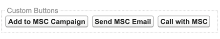
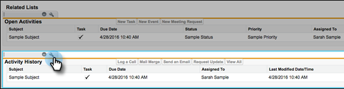
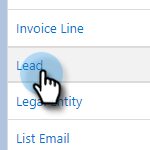
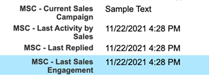

# Désinstaller Marketo Sales Connect de Salesforce Lightning {#uninstall-marketo-sales-connect-from-salesforce-lightning}

Voici comment désinstaller le package Marketo Sales Connect de votre compte Salesforce une fois que vous avez commencé à utiliser les actions Sales Insight.

## Supprimer les champs Sales Connect de la mise en page {#remove-sales-connect-fields-from-page-layout}

1. Dans Salesforce Lightning, cliquez sur l&#39;icône d&#39;engrenage et sélectionnez **Configuration**.

   

1. Cliquez sur **Gestionnaire d’objets**.

   

1. Faites défiler jusqu’à et sélectionnez **Lead**.

   

1. Cliquez sur **Dispositions de page**.

   

1. Cliquez sur **Disposition du lead**.

   

   >[!NOTE]
   >
   >La vue Modifier la disposition de la page n’a pas encore été mise à jour dans Salesforce Lightning.

1. Dans la console, sélectionnez **Champs**. Dans Recherche rapide, recherchez « MSC ». Tous les champs grisés ont été ajoutés à votre mise en page. Vous devrez les supprimer.

   

   >[!NOTE]
   >
   >Si aucun des champs n’est grisé, cela signifie que vous ne les avez pas ajoutés à votre mise en page. Vous pouvez ignorer cette section.

1. Faites défiler l’écran jusqu’à la section contenant vos champs personnalisés Sales Connect.

   

1. Il existe 10 types de champs MSC qui peuvent être ajoutés à cette section. Supprimez tous les champs que vous avez ajoutés ou supprimez simplement la section entière.

1. Cliquez sur **Enregistrement rapide** lorsque vous avez terminé.

   

## Supprimer les boutons Sales Connect des mises en page {#remove-sales-connect-buttons-from-page-layouts}

1. Dans la console (étape 4 ci-dessus), sélectionnez **Boutons**. Recherchez « MSC ». Tous les boutons grisés ont été ajoutés à la section de votre bouton personnalisé. Vous devrez les supprimer.

   

   >[!NOTE]
   >
   >Si aucun des boutons n’est grisé, cela signifie que vous ne les avez pas ajoutés. Vous pouvez ignorer cette section.

1. Faites glisser et déposez les boutons MSC de la section Boutons personnalisés vers la console.

   

1. Cliquez sur **Enregistrement rapide** lorsque vous avez terminé.

   

## Supprimer les champs Sales Connect de la section Historique des activités {#remove-sales-connect-fields-from-activity-history-section}

1. Faites défiler la page jusqu’au bas, dans la section Liste associée Historique des activités , puis cliquez sur l’icône Clé à molette .

   

1. Sélectionnez les champs Sales Connect dans la zone Selected Fields et cliquez sur la flèche Remove. Cliquez sur **OK** lorsque vous avez terminé.

   

   >[!NOTE]
   >
   >L’abréviation MSE _is_ Sales Connect. Il s’agit simplement du nom précédent, « Engagement commercial de Marketo ».

1. Cliquez sur **Enregistrer** lorsque vous avez fini d’utiliser la page Prospects.

## Supprimer les boutons d&#39;action en bloc Sales Connect de la vue Liste de leads {#remove-sales-connect-bulk-action-buttons-from-lead-list-view}

1. Dans Salesforce Lightning, cliquez sur l&#39;icône d&#39;engrenage et sélectionnez **Configuration**.

   

1. Cliquez sur **Gestionnaire d’objets**.

   

1. Faites défiler jusqu’à et sélectionnez **Lead**.

   

1. Cliquez sur **Rechercher des mises en page**.

   

1. Cliquez sur la flèche à côté de Vue Liste et sélectionnez **Modifier**.

   

1. Sélectionnez **Ajouter à MSC Campaign**, **E-mail avec MSC** et **Push vers MSC**, puis cliquez sur la flèche de suppression. Cliquez ensuite sur **Enregistrer**.

   

Vous ne devriez plus voir les boutons dans la vue Liste de prospects.

## Supprimer la configuration MSC pour les contacts {#remove-msc-configuration-for-contacts}

1. Dans Salesforce Lightning, cliquez sur l&#39;icône d&#39;engrenage et sélectionnez **Configuration**.

1. Cliquez sur **Gestionnaire d’objets**.

1. Faites défiler jusqu’à et sélectionnez **Contact**.

1. Cliquez sur **Dispositions de page**.

1. Cliquez sur **Mise en page du contact**.

1. Répétez les étapes des trois sections.

## Supprimer la configuration MSC pour l’opportunité {#remove-msc-configuration-for-opportunity}

1. Dans Salesforce Lightning, cliquez sur l&#39;icône d&#39;engrenage et sélectionnez **Configuration**.

1. Cliquez sur **Gestionnaire d’objets**.

1. Faites défiler jusqu’à et sélectionnez **Opportunité**.

1. Cliquez sur **Dispositions de page**.

1. Cliquez sur **Disposition de l’opportunité**.

La vue Opportunité ne comporte qu’un seul bouton - « Envoyer un e-mail MSE » et les champs suivants :

## Supprimer la configuration MSC pour le compte {#remove-msc-configuration-for-account}

1. Dans Salesforce Lightning, cliquez sur l&#39;icône d&#39;engrenage et sélectionnez **Configuration**.

1. Cliquez sur **Gestionnaire d’objets**.

1. Faites défiler jusqu’à et sélectionnez **Compte**.

1. Cliquez sur **Dispositions de page**.

1. Cliquez sur **Disposition du compte**.

La vue Compte ne comporte qu’un seul bouton - « Envoyer un e-mail MSE » et les champs suivants :

## Supprimer la boîte d’envoi des ventes Marketo {#remove-marketo-sales-outbox}

1. Dans Salesforce, cliquez sur l’onglet **+** en haut de votre écran.

1. Cliquez sur **Personnaliser mes onglets**.

1. Sélectionnez l’option Boîte d’envoi Ventes Marketo à droite. Cliquez sur la flèche Supprimer, puis sur **Enregistrer**.

## Supprimer le package Sales Connect {#delete-sales-connect-package}

Une fois que vous avez supprimé tous les objets de votre compte Salesforce, procédez comme suit.

1. Dans Salesforce Lightning, cliquez sur l&#39;icône d&#39;engrenage et sélectionnez **Configuration**.

1. Dans la zone Recherche rapide, saisissez « Classes apex ».

1. Cliquez sur **Supprimer** en regard de toutes les entrées « MarketoSalesConnectionCustomization » ou « MarketoSalesEngageCustomization » de votre liste.

Tout est prêt !

Voici une liste de tous les objets qui doivent être supprimés de votre instance Salesforce :

## Détails de personnalisation de Sales Connect {#sales-connect-customization-details}

<table>
 <tr>
  <th>Champs d’activité personnalisés</th>
  <th>Description</th>
  <th>Type</th>
  <th>Type de données</th>
 </tr>
 <tr>
  <td>ID de présence locale de l'appel MSC</td>
  <td>En tant qu'utilisateur, je peux choisir l'option Présence locale lorsque je passe des appels depuis le téléphone du MSC. Les appels entrants affichent un numéro local pour le destinataire</td>
  <td>Activité</td>
  <td>Texte</td>
 </tr>
 <tr>
  <td>URL d’enregistrement d’appel MSC</td>
  <td>Les appels peuvent être enregistrés et un lien vers l’enregistrement sera consigné ici. </td>
  <td>Activité</td>
  <td>Texte</td>
 </tr>
 <tr>
  <td>Campagne MSC</td>
  <td>Consigne le nom de la campagne du MSC sur laquelle se trouve le contact/prospect</td>
  <td>Activité</td>
  <td>Texte</td>
 </tr>
 <tr>
  <td>URL de la campagne MSC</td>
  <td>Consigne l’URL de la campagne créée dans le MSC. Cliquez sur ce bouton pour ouvrir la campagne dans l’application web du MSC</td>
  <td>Activité</td>
  <td>Texte</td>
 </tr>
 <tr>
  <td>Étape actuelle de la campagne MSC</td>
  <td>Si un contact/prospect figure dans une campagne, ce champ consigne le nom de l’étape à laquelle il se trouve actuellement</td>
  <td>Activité</td>
  <td>Case à cocher</td>
 </tr>
 <tr>
  <td>Pièce jointe d’e-mail MSC vue</td>
  <td>Consigne les données lorsqu’un e-mail est envoyé avec une pièce jointe que le destinataire peut consulter</td>
  <td>Activité</td>
  <td>Case à cocher</td>
 </tr>
 <tr>
  <td>E-mail MSC sur lequel l’utilisateur a cliqué</td>
  <td>Enregistre une coche lorsque le destinataire clique sur un lien dans l’e-mail</td>
  <td>Activité</td>
  <td>Case à cocher</td>
 </tr>
 <tr>
  <td>Réponse à un e-mail du MSC</td>
  <td>Enregistre une coche lorsque le destinataire répond à l’e-mail</td>
  <td>Activité</td>
  <td>Texte</td>
 </tr>
 <tr>
  <td>Statut des e-mails MSC</td>
  <td>Indique si un email est envoyé/en cours/rebond (le suivi des emails rebonds dépend du canal de diffusion utilisé)</td>
  <td>Activité</td>
  <td>Texte</td>
 </tr>
 <tr>
  <td>Modèle d’e-mail MSC</td>
  <td>Consigne le nom du modèle MSC utilisé dans l’e-mail envoyé au prospect/contact</td>
  <td>Activité</td>
  <td>Texte</td>
 </tr>
 <tr>
  <td>URL du modèle d'e-mail MSC</td>
  <td>Consigne l’URL vers le modèle qui a été créé dans MSC. Cliquez sur ce bouton pour ouvrir le modèle dans l'application Web du MSC</td>
  <td>Activité</td>
  <td>Texte</td>
 </tr>
 <tr>
  <td>URL de l’e-mail MSC</td>
  <td>Cliquez sur cette URL pour ouvrir le centre de commande dans MSC et afficher l’onglet Historique d’affichage des détails des personnes dans lequel l’utilisateur peut voir l’e-mail envoyé</td>
  <td>Activité</td>
  <td>Texte</td>
 </tr>
 <tr>
  <td>E-mail MSC consulté</td>
  <td>Enregistre une coche lorsque le destinataire consulte un e-mail</td>
  <td>Activité</td>
  <td>Case à cocher</td>
 </tr>
</table>

<table>
 <tr>
  <th>Champ de journalisation du cumul MSC</th>
  <th>Description</th>
  <th>Type</th>
  <th>Type de données</th>
 </tr>
 <tr>
  <td>MSC - Dernier engagement marketing</td>
  <td>Dernier engagement entrant du marketing</td>
  <td>
  
Compte
  
Contact
  
Prospect
  
Opportunité</td>
  <td>Données et temps</td>
 </tr>
 <tr>
  <td>MSC - Date du dernier engagement marketing</td>
  <td>Date et heure de l’engagement à partir du marketing</td>
  <td>
  
Compte
  
Contact
  
Prospect
  
Opportunité</td>
  <td>Données et temps</td>
 </tr>
 <tr>
  <td>MSC - Description du dernier engagement marketing</td>
  <td>Description de l’engagement</td>
  <td>
  
Compte
  
Contact
  
Prospect
  
Opportunité</td>
  <td>Texte</td>
 </tr>
 <tr>
  <td>MSC - Dernier engagement marketing Source</td>
  <td>Source de l’engagement marketing</td>
  <td>
  
Compte
  
Contact
  
Prospect
  
Opportunité</td>
  <td>Texte</td>
 </tr>
 <tr>
  <td>MSC - Dernier type d’engagement marketing</td>
  <td>Type d’engagement (ex : activité Web)</td>
  <td>
  
Compte
  
Contact
  
Prospect
  
Opportunité</td>
  <td>Texte</td>
 </tr>
 <tr>
  <td>MSC - Dernière activité par ventes</td>
  <td>Dernière activité sortante réalisée par l'équipe commerciale</td>
  <td>
  
Compte
  
Contact
  
Prospect
  
Opportunité</td>
  <td>Données et temps</td>
 </tr>
 <tr>
  <td>MSC - Dernière réponse</td>
  <td>Dernier e-mail de réponse à l’e-mail de vente</td>
  <td>
  
Compte
  
Contact
  
Prospect
  
Opportunité</td>
  <td>Données et temps</td>
 </tr>
 <tr>
  <td>MSC - Campagne de vente actuelle</td>
  <td>Consigne le nom de la campagne du MSC sur laquelle se trouve le contact/prospect</td>
  <td>
  
Compte
  
Contact
  
Prospect
  
Opportunité</td>
  <td>Texte</td>
 </tr>
 <tr>
  <td>MSC - Dernier engagement commercial</td>
  <td>Dernier engagement entrant des ventes</td>
  <td>
  
Compte
  
Contact
  
Prospect
  
Opportunité</td>
  <td>Données et temps</td>
 </tr>
 <tr>
  <td>MSC - Opt-out</td>
  <td>Champ d’opt-out</td>
  <td>
  
Compte
  
Contact
  
Prospect
  
Opportunité</td>
  <td>Case à cocher</td>
 </tr>
</table>

<table>
 <tr>
  <th>Boutons MSC</th>
  <th>Description</th>
  <th>Type</th>
 </tr>
 <tr>
  <td>Envoyer un e-mail au MSC</td>
  <td>Envoyer des e-mails de vente à partir de Salesforce</td>
  <td>
  
Compte
  
Contact
  
Prospect
  
Opportunité</td>
 </tr>
 <tr>
  <td>Ajouter à MSC Campaign</td>
  <td>Ajouter aux campagnes MSC à partir de Salesforce</td>
  <td>
  
Contact
  
Lead</td>
 </tr>
 <tr>
  <td>Intégrer au MSC</td>
  <td>Intégrer le contact de Salesforce au MSC</td>
  <td>
  
Contact
  
Lead</td>
 </tr>
 <tr>
  <td>Appel avec MSC</td>
  <td>Effectuer des appels commerciaux depuis Salesforce</td>
  <td>
  
Contact
  
Lead</td>
 </tr>
</table>

<table>
 <tr>
  <th>Boutons d’action en bloc du MSC</th>
  <th>Description</th>
  <th>Type</th>
 </tr>
 <tr>
  <td>Ajouter à MSC Campaign</td>
  <td>Ajouter aux campagnes MSC à partir de Salesforce</td>
  <td>
  
Contact
  
Lead</td>
 </tr>
 <tr>
  <td>Intégrer au MSC</td>
  <td>Intégrer le contact de Salesforce au MSC</td>
  <td>
  
Contact
  
Lead</td>
 </tr>
 <tr>
  <td>E-mail avec MSC</td>
  <td>E-mail avec MSC depuis Salesforce</td>
  <td>
  
Contact
  
Lead</td>
 </tr>
</table>
