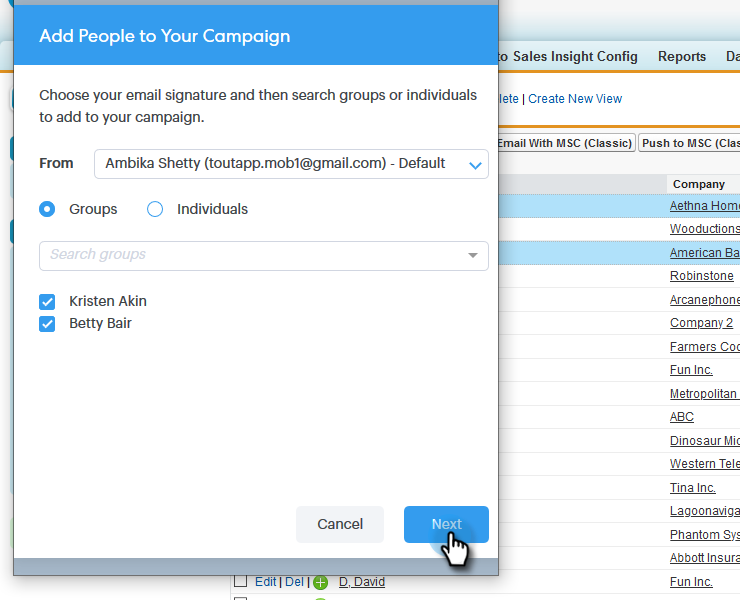

# Utilisation d’actions en bloc dans Salesforce Classic {#using-bulk-actions-in-salesforce-classic}

Découvrez comment effectuer des actions en masse, comme ajouter des pistes à une campagne, envoyer un courriel en masse ou pousser des pistes de Salesforce à Sales Connect.

>[!PREREQUISITES]
>
>Mettez à jour vers la dernière version du package Sales Connect et installez les boutons d&#39;action en bloc dans votre vue prospect/contact. [Cliquez ici pour obtenir des instructions](http://s3.amazonaws.com/tout-user-store/salesforce/assets/Marketo+Sales+Engage+For+Salesforce_+Installation+and+Success+Guide.pdf).

>[!NOTE]
>
>Avant de suivre les étapes décrites, vérifiez que vous êtes connecté à votre compte Marketing Connect.

## Courriel en bloc {#bulk-email}

1. Dans Salesforce, cliquez sur l&#39;onglet **Pistes**, puis sur le bouton **Aller**.

   

1. Choisissez les pistes souhaitées et cliquez sur le bouton **Courriel avec MSC (Classic)**.

   

1. Un message électronique du SMC apparaîtra. Il comprend les fonctionnalités suivantes :

   a. Le champ &quot;À&quot; affiche &quot;Tous les reçus&quot;, ce qui correspond à la liste des pistes que vous avez choisies dans la Vue Liste de piste\
   b. Cette liste est visible dans le panneau de gauche intitulé &quot;Compression en masse&quot;. Vous pouvez ajouter ou supprimer des destinataires ici.\
   c. Vous pouvez choisir un modèle ou créer votre propre adresse électronique\
   d. Vous pouvez prévisualisation des champs dynamiques qui seront renseignés dans votre courrier électronique.\
   e. Vous pouvez envoyer le courriel immédiatement ou programmer son envoi ultérieurement.

   

## Ajouter à Campaign {#add-to-campaign}

1. Dans Salesforce, cliquez sur l&#39;onglet **Pistes**, puis sur le bouton **Aller**.

   

1. Choisissez les pistes souhaitées et cliquez sur le bouton **Ajouter au Campaign MSC (Classic)**.

   

1. Une fenêtre contextuelle &quot;Ajouter les personnes à votre Campaign&quot; s’affiche. Cliquez sur **Suivant** et passez en revue le flux de campagne type pour déclencher une campagne MSC.

   

## Poussez à Marketing Sales Connect {#push-to-marketo-sales-connect}

1. Dans Salesforce, cliquez sur l&#39;onglet **Pistes**, puis sur le bouton **Aller**.

   

1. Choisissez les pistes de votre choix et cliquez sur le bouton **Push to MSC (Classic)**.

   

1. Un nouvel onglet appelé &quot;Salesforce Bridge&quot; s&#39;ouvre. Cliquez sur le bouton **Accéder au groupe →**.

   

1. Vous serez envoyé à votre compte MSC où vous verrez un groupe créé avec un horodatage. Vous recevrez une notification une fois la synchronisation terminée et le groupe inclura les pistes synchronisées à partir de Salesforce.

   

>[!NOTE]
>
>Vous pouvez également suivre les mêmes étapes pour utiliser des actions en bloc dans la Vue de Liste de contacts.

>[!NOTE]
>
>**Articles connexes**
>
>* [Envoi de courriers électroniques par courriel de groupe](http://docs.marketo.com/x/KAQ6Ag)
>* [Composition de courriels en vrac avec sélection et envoi](http://docs.marketo.com/display/public/DOCS/Composing+Bulk+Emails+with+Select+and+Send#ComposingBulkEmailswithSelectandSend-SendingEmails)

>

