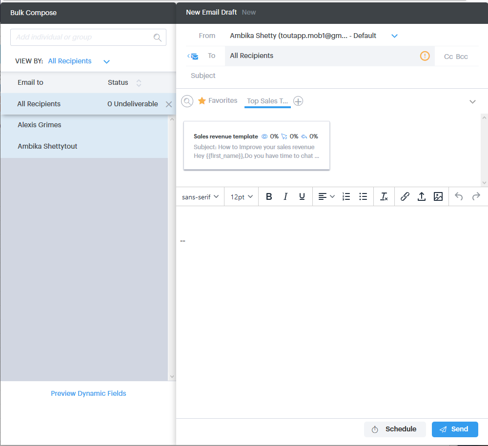

# Utilisation d’actions en bloc dans Salesforce Lightning {#using-bulk-actions-in-salesforce-lightning}

Découvrez comment exécuter des actions en bloc, comme ajouter des pistes à une campagne, envoyer un courrier électronique en bloc ou envoyer des pistes de Salesforce à Sales Connect.

>[!PREREQUISITES]
>
>Mettez à jour vers la dernière version du package Sales Connect et installez les boutons d’action en bloc dans votre vue de prospect/contact. [Cliquez ici pour obtenir des instructions](https://s3.amazonaws.com/tout-user-store/salesforce/assets/SF+Guide+for+Lightning.pdf).

>[!NOTE]
>
>Avant de suivre les étapes ci-dessous, vérifiez que vous êtes connecté à votre compte Marketo Sales Connect.

## Courrier électronique en bloc {#bulk-email}

1. Dans Salesforce, cliquez sur l’onglet **Leads** , puis sélectionnez la liste des pistes souhaitées.

   

   >[!NOTE]
   >
   >Si vous êtes déjà sur la liste que vous allez utiliser, vous devrez l’exécuter à nouveau en la choisissant dans la liste déroulante afin de vous assurer que les boutons d’action en bloc du MSC s’affichent. Il s’agit d’un comportement Salesforce qui ne peut pas être modifié.

1. Cliquez sur la liste déroulante de flèche (à l’extrémité droite de l’écran) et sélectionnez **Email with MSC**.

   

1. Un e-mail du MSC apparaîtra. Elle comprend les fonctionnalités suivantes :

   a. Le champ &quot;À&quot; affiche &quot;Tous les accusés de réception&quot; : correspond à la liste des prospects que vous avez sélectionnés en mode Liste de pistes.\
   b. Cette liste est visible dans le panneau de gauche intitulé &quot;Compression en masse&quot;. Vous pouvez y ajouter/supprimer des destinataires.\
   c. Vous pouvez choisir un modèle ou créer votre propre email\
   d. Vous pouvez envoyer l’email immédiatement ou programmer son envoi ultérieurement.

   

## Ajouter à la campagne {#add-to-campaign}

1. Dans Salesforce, cliquez sur l’onglet **Leads** , puis sélectionnez la liste des pistes souhaitées.

   

1. Cliquez sur la liste déroulante de flèche (à l’extrémité droite de l’écran) et sélectionnez **Ajouter à la campagne MSC**.

   

1. Une fenêtre contextuelle &quot;Ajouter des personnes à votre campagne&quot; s’affiche. Cliquez sur **Suivant** et parcourez le flux de campagne type pour déclencher une campagne du MSC.

   

## Intégrer à Marketo Sales Connect {#push-to-marketo-sales-connect}

1. Dans Salesforce, cliquez sur l’onglet **Leads** , puis sélectionnez la liste des pistes souhaitées.

   

1. Cliquez sur la liste déroulante de flèche (à l’extrémité droite de l’écran) et sélectionnez **Push to MSC**.

   

1. Un nouvel onglet appelé &quot;Salesforce Bridge&quot; s’ouvre. Cliquez sur le bouton **Passez au groupe →** .

   

1. Vous serez envoyé à votre compte MSC où un groupe sera créé avec l’horodatage. Vous recevrez une notification une fois la synchronisation terminée et le groupe inclura les pistes synchronisées à partir de Salesforce.

   

>[!NOTE]
>
>Vous pouvez également suivre les mêmes étapes pour utiliser des actions en bloc en mode Liste des contacts.

>[!MORELIKETHIS]
>
>* [Envoi d’emails par courriel de groupe](/help/marketo/product-docs/marketo-sales-connect/email/using-the-compose-window/sending-emails-via-group-email.md)
>* [Composite d’emails en bloc avec sélection et envoi](/help/marketo/product-docs/marketo-sales-connect/email/using-the-compose-window/composing-bulk-emails-with-select-and-send.md#sending-emails)
