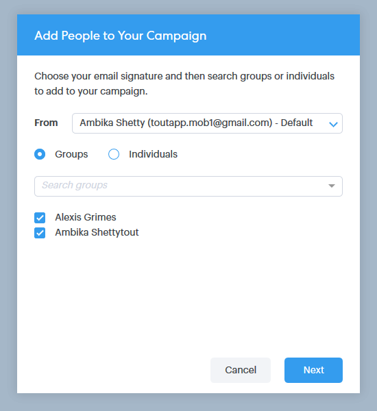

# Utilisation d’actions en masse dans l’éclair Salesforce {#using-bulk-actions-in-salesforce-lightning}

Découvrez comment effectuer des actions en masse, comme ajouter des pistes à une campagne, envoyer un courriel en masse ou pousser des pistes de Salesforce à Sales Connect.

>[!PREREQUISITES]
>
>Mettez à jour vers la dernière version du package Sales Connect et installez les boutons d&#39;action en bloc dans votre vue prospect/contact. [Cliquez ici pour obtenir des instructions](http://s3.amazonaws.com/tout-user-store/salesforce/assets/SF+Guide+for+Lightning.pdf).

>[!NOTE]
>
>Avant de suivre les étapes ci-dessous, vérifiez que vous êtes connecté à votre compte Marketing Cloud Sales Connect.

## Courrier électronique en masse {#bulk-email}

1. Dans Salesforce, cliquez sur l&#39;onglet **Pistes** , puis choisissez la liste des pistes souhaitées.

   

   >[!NOTE]
   >
   >Si vous êtes déjà sur la liste que vous allez utiliser, vous devrez l&#39;exécuter de nouveau en le choisissant dans la liste déroulante afin de vous assurer que les boutons d&#39;action en masse MSC s&#39;affichent. Il s&#39;agit du comportement de Salesforce qui ne peut pas être modifié.

1. Cliquez sur la liste déroulante des flèches (à l’extrême droite de l’écran) et sélectionnez **Courriel avec MSC**.

   

1. Un message électronique du SMC apparaîtra. Il comprend les fonctionnalités suivantes :

   a. Le champ &quot;À&quot; affiche &quot;Tous les reçus&quot;, ce qui correspond à la liste des pistes que vous avez choisies dans la Vue Liste de piste\
   b. Cette liste est visible dans le panneau de gauche intitulé &quot;Compression en masse&quot;. Vous pouvez ajouter ou supprimer des destinataires ici.\
   c. Vous pouvez choisir un modèle ou créer votre propre adresse électronique\
   d. Vous pouvez envoyer le courriel immédiatement ou programmer son envoi ultérieurement.

   

## Ajouter à Campaign {#add-to-campaign}

1. Dans Salesforce, cliquez sur l&#39;onglet **Pistes** , puis choisissez la liste des pistes souhaitées.

   

1. Cliquez sur la liste déroulante des flèches (à l’extrême droite de l’écran) et sélectionnez **Ajouter au Campaign** MSC.

   

1. Une fenêtre contextuelle &quot;Ajouter les personnes à votre Campaign&quot; s’affiche. Cliquez sur **Suivant** et passez en revue le flux de campagne type pour déclencher une campagne MSC.

   

## Poussez à la connexion commerciale {#push-to-marketo-sales-connect}

1. Dans Salesforce, cliquez sur l&#39;onglet **Pistes** , puis choisissez la liste des pistes souhaitées.

   

1. Cliquez sur la liste déroulante des flèches (à l’extrême droite de l’écran) et sélectionnez **Push to MSC**(Push to MSC).

   

1. Un nouvel onglet appelé &quot;Salesforce Bridge&quot; s&#39;ouvre. Cliquez sur le bouton **Passez au groupe →** .

   

1. Vous serez envoyé à votre compte MSC où vous verrez un groupe créé avec un horodatage. Vous recevrez une notification une fois la synchronisation terminée et le groupe inclura les pistes synchronisées à partir de Salesforce.

   

>[!NOTE]
>
>Vous pouvez également suivre les mêmes étapes pour utiliser des actions en bloc dans la Vue de Liste de contacts.

>[!NOTE]
>
>**Articles connexes**
>
>* [Envoi de courriers électroniques par courriel de groupe](http://docs.marketo.com/x/KAQ6Ag)
>* [Composition de courriels en vrac avec sélection et envoi](http://docs.marketo.com/display/public/DOCS/Composing+Bulk+Emails+with+Select+and+Send#ComposingBulkEmailswithSelectandSend-SendingEmails)

>

