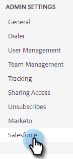

# Configuration de la personnalisation des détails de l’activité Salesforce {#configure-salesforce-activity-detail-customization}

>[!PREREQUISITES]
>
>* Salesforce et Marketo Sales Connect [ doit être connecté ](/help/marketo/product-docs/marketo-sales-connect/crm/salesforce-integration/connect-your-sales-connect-account-to-salesforce.md)
>* La journalisation de l&#39;activité de courrier électronique via l&#39;API [ doit être activée](/help/marketo/product-docs/marketo-sales-connect/crm/salesforce-integration/salesforce-sync-settings.md)

La personnalisation des détails de l’activité permet aux administrateurs de configurer les informations qui se connecteront au champ d’objet Tâche Salesforce lorsqu’une tâche de rappel/activité de connexion aux ventes est synchronisée avec Salesforce.

>[!NOTE]
>
>* Les mises à jour apportées au champ d’objet dans Sales Connect d’une tâche de rappel seront répercutées dans le champ d’objet de la tâche Salesforce correspondante, si vous utilisez le champ dynamique `{{activity_subject}}` dans votre personnalisation des détails de l’activité.
>* Les sauts de ligne ne sont pas pris en charge lors de la journalisation des informations dans le champ d’objet Salesforce. Tout saut de ligne dans l’éditeur de personnalisation des détails de l’activité est supprimé lorsqu’un objet de tâche de vente est mis à jour.

<table>
 <tr>
  <td><strong>1</td>
  <td>Tâche InMail Reminder</td>
 </tr>
 <tr>
  <td><strong>2</td>
  <td>Activité d’e-mail</td>
 </tr>
 <tr>
  <td><strong>3</td>
  <td>Activité d’appel</td>
 </tr>
</table>

Cette fonctionnalité peut être utilisée pour déverrouiller les avantages suivants :

* En personnalisant les informations visibles dans le champ d’objet, les détails de l’activité sont facilement analysables pour les ventes dans Salesforce.
* Les administrateurs peuvent baliser le champ d’objet avec un identifiant unique tel que &quot;Mkto_sales&quot; afin que les activités de Sales Connect puissent être facilement identifiées et différenciées des autres activités de courrier électronique, activités d’appel et tâches.
* Réduisez le besoin de champs d’activité personnalisés. Salesforce applique des limites au nombre de champs d’activité personnalisés, ce qui peut limiter les données pouvant être utilisées dans les rapports. En utilisant des champs dynamiques d’activité pour ajouter des données clés à la ligne d’objet, vous pouvez réduire le nombre de champs d’activité personnalisés que vous avez besoin de créer dans votre instance Salesforce.
* Le champ d’objet des activités et des tâches suit un modèle cohérent défini par l’administrateur de Sales Connect.

>[!NOTE]
>
>Si vous enregistrez des réponses par courrier électronique en tant qu’activités dans Salesforce, ils n’utiliseront pas les paramètres de personnalisation des détails de l’activité Salesforce. Au lieu de cela, ils se connectent en tant que &quot;Réponse : objet de l’email&quot;.

## Champs dynamiques d’activité pris en charge {#activity-dynamic-fields-supported}

Les champs dynamiques d’activité renvoient des informations sur vos activités de vente pour renseigner les données. Aujourd’hui, elles peuvent être utilisées avec la personnalisation des détails de l’activité Salesforce.

>[!NOTE]
>
>S’il n’y a aucune valeur pour renseigner le champ dynamique pour une activité/tâche spécifique, il ne renseigne aucune donnée pour ce champ dynamique lorsque le champ Tâche Salesforce - Champ d’objet est mis à jour.

<table>
 <tr>
  <th>Champ</th>
  <th>Description</th>
 </tr>
 <tr>
  <td>{{activity_type}}</td>
  <td>Définit le type de tâche sur Email, Call, InMail ou Custom.</td>
 </tr>
 <tr>
  <td>{{activity_subject}}</td>
  <td>
Remplira l’objet de la tâche.

      
Dans le cas d’un email, il renseigne l’objet de l’email.

      
Dans le cas d’un appel, d’un message inMail ou d’un message personnalisé, une valeur est renseignée si une tâche de rappel a été créée avec une valeur dans le champ du nom/de l’objet de la tâche.
</td>
 </tr>
 <tr>
  <td>{{sales_campaign_name}}</td>
  <td>Si l’activité a été lancée à partir d’une campagne de ventes, elle renseigne le nom de la campagne de ventes.</td>
 </tr>
 <tr>
  <td>{{sales_campaign_day}}</td>
  <td>Si l’activité a été lancée à partir d’une campagne de ventes, elle indique le numéro du jour de la campagne de ventes où elle a eu lieu.</td>
 </tr>
 <tr>
  <td>{{sales_campaign_step}}</td>
  <td>Si l’activité a été lancée à partir d’une campagne de ventes, elle indique le numéro de l’étape dans le jour de la campagne de vente où cette activité a eu lieu.</td>
 </tr>
 <tr>
  <td>{{call_outcome}}</td>
  <td>Si l’activité est un appel et qu’un résultat d’appel est sélectionné, la valeur du résultat de l’appel est renseignée.</td>
 </tr>
 <tr>
  <td>{{call_reason}}</td>
  <td>Si l’activité est un appel et qu’un motif d’appel est sélectionné, la valeur de la raison de l’appel est renseignée.</td>
 </tr>
</table>

## Configuration de la personnalisation des détails de l’activité Salesforce {#configuring-salesforce-activity-detail-customization}

>[!NOTE]
>
>**Autorisations d’administrateur requises.**

Lors de la configuration des détails de votre activité, tenez compte des données qui seraient les plus pertinentes pour les ventes lors de la révision de l’historique des tâches dans Salesforce.

1. Cliquez sur l’icône d’engrenage et sélectionnez **Paramètres**.

   

1. Cliquez sur **Salesforce**.

   

1. Cliquez sur **Paramètres de synchronisation**.

   

1. Dans l’éditeur de personnalisation des détails de l’activité, ajoutez le texte libre de votre choix. Le texte que vous ajoutez n’est pas dynamique et reste inchangé pour le champ d’objet de toutes les tâches synchronisées avec Salesforce.

   

   >[!TIP]
   >
   >Bien qu’il ne soit pas obligatoire, l’encapsulation du texte ajouté entre crochets peut faciliter la distinction entre les données lorsqu’elles sont renseignées dans un champ d’objet de Salesforce. Exemple : `[Sales Connect] - {{Activity_type}}`

1. Ajoutez d’autres champs dynamiques en cliquant sur le bouton **Ajouter un champ dynamique** .

   

1. Sélectionnez le ou les champs dynamiques souhaités.

   

1. Cliquez sur **Enregistrer**.

   

>[!NOTE]
>
>Salesforce applique une limite de 255 caractères. Si le détail de votre activité dépasse ce nombre, il sera tronqué pour s’assurer que les informations sont stockées sur le champ d’objet Salesforce.

>[!MORELIKETHIS]
>
>* [Paramètres de synchronisation](/help/marketo/product-docs/marketo-sales-connect/crm/salesforce-integration/salesforce-sync-settings.md)
>* [Synchronisation de la tâche de rappel avec Salesforce](/help/marketo/product-docs/marketo-sales-connect/tasks/reminder-task-sync-with-salesforce.md)
>* [Personnalisation de Sales Connect pour le CRM](/help/marketo/product-docs/marketo-sales-connect/crm/salesforce-customization/sales-connect-customizations-for-crm.md)
