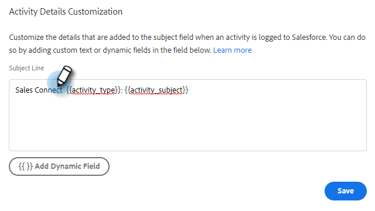

# Configurer la personnalisation des détails de l’activité [!DNL Salesforce] {#configure-salesforce-activity-detail-customization}

>[!PREREQUISITES]
>
>* [!DNL Salesforce] et [!DNL Marketo Sales Connect] [doivent être connectés](/help/marketo/product-docs/marketo-sales-connect/crm/salesforce-integration/connect-your-sales-connect-account-to-salesforce.md)
>* La journalisation de l’activité e-mail via l’API [doit être activée](/help/marketo/product-docs/marketo-sales-connect/crm/salesforce-integration/salesforce-sync-settings.md)

La personnalisation des détails de l’activité permet aux administrateurs de configurer les informations qui seront consignées dans le champ Tâche Salesforce - Objet lorsqu’une tâche d’activité/de rappel [!DNL Sales Connect] est synchronisée avec Salesforce.

>[!NOTE]
>
>* Les mises à jour apportées au champ objet en [!DNL Sales Connect] d’une tâche de rappel sont répercutées dans le champ objet de la tâche de [!DNL Salesforce] correspondante, si vous utilisez le champ dynamique `{{activity_subject}}` dans votre personnalisation des détails de l’activité.
>* Les sauts de ligne ne sont pas pris en charge lors de la journalisation des informations dans le champ objet [!DNL Salesforce]. Tous les sauts de ligne dans l’éditeur Personnalisation des détails de l’activité sont supprimés lorsqu’un objet de tâche de vente est mis à jour.

<table>
 <tr>
  <td><strong>1</td>
  <td>Tâche de rappel InMail</td>
 </tr>
 <tr>
  <td><strong>2</td>
  <td>Activité d’e-mail</td>
 </tr>
 <tr>
  <td><strong>3</td>
  <td>Activité d’appel</td>
 </tr>
</table>

Cette fonctionnalité peut être utilisée pour déverrouiller les avantages suivants :

* En personnalisant les informations visibles dans le champ de l’objet, vous pouvez facilement rechercher des détails d’activité pour les ventes dans Salesforce.
* Les administrateurs peuvent baliser le champ d’objet avec un identifiant unique tel que « Mkto_sales » afin que les activités de Sales Connect puissent être facilement identifiées et différenciées des autres activités de messagerie, d’appel et des tâches.
* Réduire le besoin de champs d’activité personnalisés Salesforce impose des limites sur le nombre de champs d’activité personnalisés, ce qui peut restreindre les données disponibles qui peuvent être utilisées dans les rapports. En utilisant des champs dynamiques d’activité pour ajouter des données essentielles à la ligne d’objet, vous pouvez réduire le nombre de champs d’activité personnalisés à créer dans votre instance Salesforce.
* Le champ d’objet des activités et des tâches suit un modèle cohérent défini par l’administrateur de Sales Connect.

>[!NOTE]
>
>Si vous enregistrez les réponses aux e-mails en tant qu’activités dans [!DNL Salesforce], les paramètres de personnalisation des détails de l’activité [!DNL Salesforce] ne seront pas utilisés. Au lieu de cela, ils se connectent en tant que « Réponse : objet de l’e-mail ».

## Champs dynamiques d’activité pris en charge {#activity-dynamic-fields-supported}

Les champs dynamiques d’activité fournissent des informations de référence sur vos activités de vente pour renseigner les données. Aujourd’hui, ils peuvent être utilisés avec la personnalisation des détails de l’activité [!DNL Salesforce].

>[!NOTE]
>
>S’il n’existe aucune valeur pour renseigner le champ dynamique pour une activité/tâche spécifique, il ne renseignera aucune donnée pour ce champ dynamique lorsque le champ [!DNL Salesforce] Tâche - Objet sera mis à jour.

<table>
 <tr>
  <th>Champ</th>
  <th>Description</th>
 </tr>
 <tr>
  <td>{{activity_type}}</td>
  <td>Remplit le type de tâche en tant qu’e-mail, appel, courrier électronique ou personnalisé.</td>
 </tr>
 <tr>
  <td>{{activity_subject}}</td>
  <td>
Renseigne l'objet de la tâche.

      
Dans le cas d’un e-mail, il renseigne la ligne d’objet de l’e-mail.

      
Dans le cas d’un appel, inMail ou personnalisé, il renseigne une valeur si une tâche de rappel a été créée avec une valeur dans le champ nom/objet de la tâche.
</td>
 </tr>
 <tr>
  <td>{{sales_campaign_name}}</td>
  <td>Si l’activité a été lancée à partir d’une campagne de vente, elle renseigne le nom de la campagne de vente.</td>
 </tr>
 <tr>
  <td>{{sales_campaign_day}}</td>
  <td>Si l'activité a été lancée à partir d'une campagne commerciale, elle renseigne le numéro du jour de la campagne commerciale où cette activité s'est produite.</td>
 </tr>
 <tr>
  <td>{{sales_campaign_step}}</td>
  <td>Si l’activité a été lancée à partir d’une campagne commerciale, le numéro d’étape est renseigné dans le jour de la campagne commerciale où cette activité a eu lieu.</td>
 </tr>
 <tr>
  <td>{{call_outcome}}</td>
  <td>Si l’activité est un appel et qu’un résultat d’appel est sélectionné, la valeur de résultat d’appel est renseignée.</td>
 </tr>
 <tr>
  <td>{{call_reason}}</td>
  <td>Si l’activité est un appel et qu’un motif d’appel est sélectionné, la valeur de motif d’appel est renseignée.</td>
 </tr>
</table>

## Configuration de la personnalisation des détails de l’activité Salesforce {#configuring-salesforce-activity-detail-customization}

>[!NOTE]
>
>**Autorisations d’administrateur requises.**

Lors de la configuration des détails de votre activité, réfléchissez aux données les plus pertinentes pour les ventes lors de la révision de l’historique des tâches dans [!DNL Salesforce].

1. Cliquez sur l’icône d’engrenage et sélectionnez **[!UICONTROL Paramètres]**.

   

1. Cliquez sur **[!UICONTROL Salesforce]**.

   

1. Cliquez sur **[!UICONTROL Paramètres de synchronisation]**.

   

1. Dans l’éditeur Personnalisation des détails de l’activité , ajoutez le texte libre de votre choix. Le texte que vous ajoutez n’est pas dynamique et reste inchangé pour le champ d’objet de toutes les tâches synchronisées avec [!DNL Salesforce].

   

   >[!TIP]
   >
   >Bien que cela ne soit pas obligatoire, le fait d’entourer de texte ajouté de crochets droits peut faciliter la distinction entre les données pour certaines personnes lorsqu’elles sont renseignées dans un champ d’objet dans Salesforce. Exemple : `[Sales Connect] - {{Activity_type}}`

1. Ajoutez les champs dynamiques supplémentaires de votre choix en cliquant sur le bouton **[!UICONTROL Ajouter un champ dynamique]**.

   

1. Sélectionnez le ou les champs dynamiques souhaités.

   

1. Cliquez sur **[!UICONTROL Enregistrer]**

   

>[!NOTE]
>
>[!DNL Salesforce] applique une limite de 255 caractères. Si le détail de votre activité est supérieur à ce nombre, il sera tronqué pour s’assurer que les informations sont stockées dans le champ d’objet [!DNL Salesforce].

>[!MORELIKETHIS]
>
>* [Paramètres de synchronisation](/help/marketo/product-docs/marketo-sales-connect/crm/salesforce-integration/salesforce-sync-settings.md)
>* [Synchronisation de la tâche de rappel avec [!DNL Salesforce]](/help/marketo/product-docs/marketo-sales-connect/tasks/reminder-task-sync-with-salesforce.md)
>* [[!DNL Sales Connect] Personnalisation pour CRM](/help/marketo/product-docs/marketo-sales-connect/crm/salesforce-customization/sales-connect-customizations-for-crm.md)
