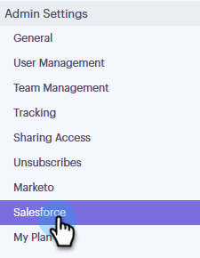

# Déconnecter Salesforce de votre compte Sales Connect {#disconnect-salesforce-from-your-sales-connect-account}

Parfois, vous devrez peut-être déconnecter votre compte [!DNL  Salesforce] de votre compte [!DNL Sales Connect]. Voici comment faire.

## Comment se déconnecter de Salesforce en tant qu’administrateur {#how-to-disconnect-from-salesforce-as-an-admin}

1. Dans [!DNL Sales Connect], cliquez sur l’icône d’engrenage en haut à droite et sélectionnez **[!UICONTROL Paramètres]**.

   

1. Sous [!UICONTROL  Admin Settings] cliquez sur **[!UICONTROL Salesforce]**.

   

1. Dans l’onglet [!UICONTROL  Connexions et personnalisations ], cliquez sur **[!UICONTROL Déconnecter]**.

   

## Comment se déconnecter de Salesforce en tant que non-administrateur {#how-to-disconnect-from-salesforce-as-a-non-admin}

1. Dans [!DNL  Sales Connect], cliquez sur l’icône d’engrenage en haut à droite et sélectionnez **[!UICONTROL Paramètres]**.

   

1. Sous [!UICONTROL  Mon compte ], sélectionnez **[!UICONTROL Salesforce]**.

   

1. Dans l’onglet [!UICONTROL  Connexions et personnalisations ], cliquez sur **[!UICONTROL Déconnecter]**.

   
