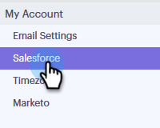

# Déconnexion De Salesforce De Votre Compte Sales Connect {#disconnect-salesforce-from-your-sales-connect-account}

Parfois, vous devrez peut-être déconnecter votre compte [!DNL &#x200B; Salesforce] de votre compte [!DNL Sales Connect]. Voici comment procéder.

## Comment se déconnecter de Salesforce en tant qu’administrateur {#how-to-disconnect-from-salesforce-as-an-admin}

1. Dans [!DNL Sales Connect], cliquez sur l’icône d’engrenage en haut à droite et sélectionnez **[!UICONTROL Paramètres]**.

   

1. Sous [!UICONTROL &#x200B; Admin Settings] cliquez sur **[!UICONTROL Salesforce]**.

   

1. Dans l’onglet [!UICONTROL &#x200B; Connexions et personnalisations &#x200B;], cliquez sur **[!UICONTROL Déconnecter]**.

   

## Comment se déconnecter de Salesforce en tant que non-administrateur {#how-to-disconnect-from-salesforce-as-a-non-admin}

1. Dans [!DNL &#x200B; Sales Connect], cliquez sur l’icône d’engrenage en haut à droite et sélectionnez **[!UICONTROL Paramètres]**.

   

1. Sous [!UICONTROL &#x200B; Mon compte &#x200B;], sélectionnez **[!UICONTROL Salesforce]**.

   

1. Dans l’onglet [!UICONTROL &#x200B; Connexions et personnalisations &#x200B;], cliquez sur **[!UICONTROL Déconnecter]**.

   
