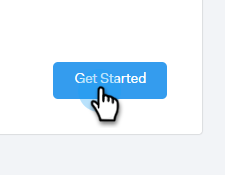

# Connexion par e-mail pour les utilisateurs Gmail {#email-connection-for-gmail-users}

La connexion à Gmail signifie que vous recevrez le suivi des réponses, que vous accéderez au canal de diffusion Gmail, que vous pourrez planifier des e-mails dans Gmail et que vous respecterez les règles en matière d’envoi.

>[!CAUTION]
>
>Si vous [utilisez des filtres](https://support.google.com/mail/answer/6579?hl=en#zippy=%2Ccreate-a-filter%2Cedit-or-delete-filters){target="_blank"} ou des règles dans votre compte Gmail pour marquer automatiquement les e-mails comme lus, cela peut entraîner des problèmes de suivi des réponses. Nous vous recommandons de désactiver toutes les règles qui marquent automatiquement les e-mails comme lus lors de l’utilisation du suivi des réponses avec Gmail.

1. Dans [!DNL Sales Connect], cliquez sur l’icône d’engrenage et sélectionnez **[!UICONTROL Paramètres]**.

   

1. Sous Mon compte, sélectionnez **[!UICONTROL Paramètres de messagerie]**.

   

1. Cliquez sur l’onglet **[!UICONTROL Connexion par e-mail]**.

   

1. Cliquez sur **[!UICONTROL Commencer]**.

   

1. Sélectionnez **[!UICONTROL J’utilise Gmail pour envoyer des e-mails]** puis cliquez sur **[!UICONTROL Suivant]**.

   

1. Cliquez sur **[!UICONTROL OK]**.

   

1. Si vous vous êtes déjà connecté à Gmail, choisissez le compte auquel vous souhaitez vous connecter. Sinon, saisissez votre adresse Gmail et cliquez sur **[!UICONTROL Suivant]**. Dans cet exemple, nous ne sommes pas encore connectés.

   

1. Saisissez votre mot de passe et cliquez sur **[!UICONTROL Suivant]**.

   

1. Cliquez sur **[!UICONTROL Autoriser]**.

   

   Vous pouvez utiliser cette connexion pour effectuer le suivi des e-mails et également comme canal de diffusion.

>[!NOTE]
>
>Gmail applique ses propres limites d’envoi. [En savoir plus ici](/help/marketo/product-docs/marketo-sales-connect/email/email-delivery/email-connection-throttling.md#email-provider-limits).
