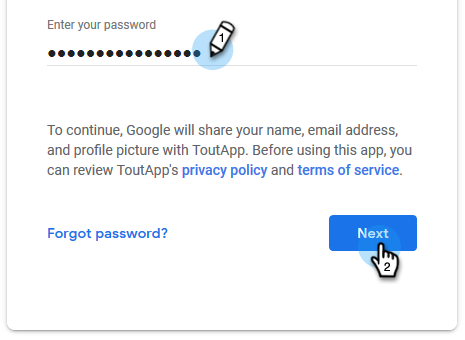

# Onglet Connexion par courriel pour les utilisateurs de Gmail {#email-connection-tab-for-gmail-users}

Se connecter à Gmail signifie que vous recevrez le suivi des réponses, l&#39;accès au canal de diffusion Gmail, la possibilité de planifier des courriels dans Gmail et d&#39;envoyer la conformité.

1. Dans Sales Connect, cliquez sur l&#39;icône représentant un engrenage et sélectionnez **Paramètres**.

   

1. Sous Mon compte, sélectionnez Paramètres **de** courriel.

   

1. Cliquez sur l’onglet Connexion **** par courriel.

   

1. Cliquez sur **Commencer**.

   

1. Sélectionnez **J&#39;utilise Gmail pour envoyer des courriels** et cliquez sur **Suivant**.

   

1. Cliquez sur **OK**.

   

1. Si vous vous êtes déjà connecté à Gmail, sélectionnez le compte auquel vous souhaitez vous connecter. Dans le cas contraire, entrez votre adresse Gmail et cliquez sur **Suivant**. Dans cet exemple, nous ne sommes pas encore connectés.

   

1. Saisissez votre mot de passe et cliquez sur **Suivant**.

   

1. Cliquez sur **Autoriser**.

   

   Vous pouvez utiliser cette connexion pour effectuer le suivi des courriers électroniques et [en tant que canal](http://docs.marketo.com/display/public/DOCS/Setting+up+Your+Delivery+Channel#SettingupYourDeliveryChannel-Gmail)de diffusion.

