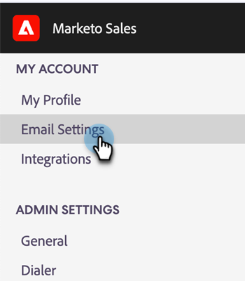

# Installer le plug-in d’e-mail Sales Connect pour Gmail {#install-the-sales-connect-email-plugin-for-gmail}

Découvrez comment installer le plug-in Gmail.

>[!IMPORTANT]
>
>Les modules externes d’e-mail pour Gmail et Outlook sont pris en charge pour les utilisateurs de Marketo Sales Connect uniquement. Ils ne sont **pas** pris en charge pour les utilisateurs et utilisatrices de Sales Insight Actions.

1. Dans l’[application web](https://toutapp.com/next#settings), cliquez sur l’icône d’engrenage, puis sur **[!UICONTROL Paramètres]**.

   

1. Sous Mon compte, cliquez sur **[!UICONTROL Paramètres de messagerie]**.

   

1. Cliquez sur l’onglet **[!UICONTROL Plugins]**.

   

1. Sous Gmail et Google Apps, cliquez sur **[!UICONTROL Installer]**.

   
