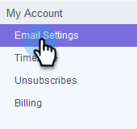

# Connexion par courriel pour les utilisateurs d&#39;Outlook {#email-connection-for-outlook-users}

Découvrez comment connecter votre compte Sales Connect à Outlook.

>[!NOTE]
>
>Chaque utilisateur doit se connecter à Outlook à partir de son compte Sales Connect.

## Connexion à Outlook Online {#connecting-to-outlook-online}

La connexion à Outlook signifie que vous recevrez le suivi des réponses, l&#39;accès au canal de la diffusion Outlook, la possibilité de planifier des courriers électroniques dans Outlook et d&#39;envoyer la conformité.

1. Dans Sales Connect, cliquez sur l&#39;icône représentant un engrenage et sélectionnez **Paramètres**.

   

1. Sous Mon compte, sélectionnez **Paramètres de courriel**.

   

1. Cliquez sur l&#39;onglet **Connexion par courriel**.

   

1. Cliquez sur **Commencer**.

   

1. Sélectionnez **J&#39;utilise Outlook pour envoyer des courriels** et cliquez sur **Suivant**.

   

1. Sélectionnez la version d&#39;Outlook que vous utilisez et cliquez sur **Suivant**. Dans cet exemple, nous choisissons Outlook Online.

   

   <table> 
    <tbody>
     <tr>
      <td><strong>Outlook Online</strong></td> 
      <td>Également connu sous le nom d'Exchange Online</td> 
     </tr>
     <tr>
      <td><strong>Exchange sur site</strong></td> 
      <td>Inclut Exchange 2013 et 2016</td> 
     </tr>
    </tbody>
   </table>

   >[!NOTE]
   >
   >Actuellement, Marketing ne prend pas en charge les comptes Exchange Hybrid.

1. Cliquez sur **OK**.

   

1. Si vous n&#39;êtes pas connecté à Outlook, entrez vos informations de connexion et cliquez sur **Suivant**. Si tel est le cas, choisissez le compte auquel vous souhaitez vous connecter et cliquez sur **Suivant**. Dans cet exemple, nous sommes déjà connectés.

   

1. Cliquez sur **Accepter**.

   

   Vous pouvez utiliser cette connexion pour effectuer le suivi des courriers électroniques et aussi comme canal de diffusion.

   >[!NOTE]
   >
   >Outlook Online (Office365) applique ses propres limites d&#39;envoi. [En savoir plus ici](/help/marketo/product-docs/marketo-sales-connect/email/email-delivery/email-connection-throttling.md#email-provider-limits).

## Connexion à Exchange On-Premise {#connecting-to-exchange-on-premise}

La connexion à Exchange On-Premise signifie que vous recevrez le suivi des réponses, l&#39;accès au canal de la diffusion Outlook, la possibilité de planifier des courriers électroniques dans Outlook et d&#39;envoyer la conformité.

1. Dans Sales Connect, cliquez sur l&#39;icône représentant un engrenage et sélectionnez **Paramètres**.

   

1. Sous Mon compte, sélectionnez **Paramètres de courriel**.

   

1. Cliquez sur l&#39;onglet **Connexion par courriel**.

   

1. Cliquez sur **Commencer**.

   

1. Sélectionnez **J&#39;utilise Outlook pour envoyer des courriels** et cliquez sur **Suivant**.

   

1. Sélectionnez la version d&#39;Outlook que vous utilisez et cliquez sur **Suivant**. Dans cet exemple, nous choisissons Exchange On-premise.

   

   <table> 
    <tbody>
     <tr>
      <td><strong>Outlook Online</strong></td> 
      <td>Également connu sous le nom d'Exchange Online</td> 
     </tr>
     <tr>
      <td><strong>Exchange sur site</strong></td> 
      <td>Inclut Exchange 2013 et 2016</td> 
     </tr>
    </tbody>
   </table>

1. Saisissez vos informations d’identification et cliquez sur **Se connecter**.

   

   >[!NOTE]
   >
   >Si vous désactivez la découverte automatique dans la liste déroulante Version d&#39;Exchange, vous devrez demander à votre service informatique l&#39;URL d&#39;Exchange.

   Vous pouvez utiliser cette connexion pour effectuer le suivi des courriers électroniques et aussi comme canal de diffusion.

   >[!NOTE]
   >
   >Lors de l&#39;utilisation d&#39;Exchange On-Prem, votre équipe informatique établira votre limite d&#39;envoi de courrier électronique.
