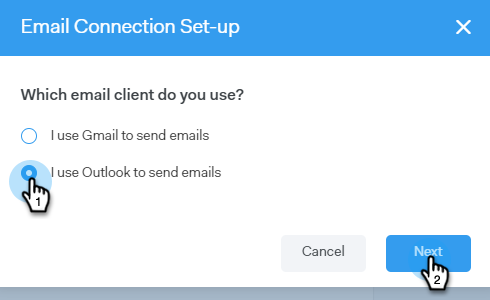

# Connexion par e-mail pour les utilisateurs Outlook {#email-connection-for-outlook-users}

Découvrez comment connecter votre compte Sales Connect à Outlook.

>[!NOTE]
>
>Chaque utilisateur doit se connecter à Outlook à partir de son compte Sales Connect.

## Connexion à Outlook Online {#connecting-to-outlook-online}

La connexion à Outlook signifie que vous recevrez le suivi des réponses, l’accès au canal de diffusion Outlook, la possibilité de planifier des emails dans Outlook et d’envoyer la conformité.

1. Dans Sales Connect, cliquez sur l’icône d’engrenage et sélectionnez **Paramètres**.

   

1. Sous Mon compte, sélectionnez **Paramètres de messagerie électronique**.

   

1. Cliquez sur le bouton **Connexion par e-mail** .

   

1. Cliquez sur **Prise en main**.

   

1. Sélectionner **J’utilise Outlook pour envoyer des emails** et cliquez sur **Suivant**.

   

1. Sélectionnez la version d’Outlook que vous utilisez, puis cliquez sur **Suivant**. Dans cet exemple, nous choisissons Outlook Online.

   

   <table> 
    <tbody>
     <tr>
      <td><strong>Outlook Online</strong></td> 
      <td>Également appelé Exchange Online</td> 
     </tr>
     <tr>
      <td><strong>Exchange On-premise</strong></td> 
      <td>Inclut Exchange 2013 et 2016</td> 
     </tr>
    </tbody>
   </table>

   >[!NOTE]
   >
   >Marketo ne prend actuellement pas en charge les comptes hybrides Exchange.

1. Cliquez sur **OK**.

   

1. Si vous n’êtes pas connecté à Outlook, saisissez les informations de connexion, puis cliquez sur **Suivant**. Si tel est le cas, sélectionnez le compte auquel vous souhaitez vous connecter, puis cliquez sur **Suivant**. Dans cet exemple, nous sommes déjà connectés.

   

1. Cliquez sur **Accepter**.

   

   Vous pouvez utiliser cette connexion pour effectuer le suivi des emails, mais aussi comme canal de diffusion.

   >[!NOTE]
   >
   >Outlook Online (Office365) applique ses propres limites d’envoi. [En savoir plus ici](/help/marketo/product-docs/marketo-sales-connect/email/email-delivery/email-connection-throttling.md#email-provider-limits).

## Connexion à Exchange On-Premise {#connecting-to-exchange-on-premise}

La connexion à Exchange On-Premise signifie que vous recevrez le suivi des réponses, l’accès au canal de diffusion Outlook, la possibilité de planifier des emails dans Outlook et d’envoyer la conformité.

1. Dans Sales Connect, cliquez sur l’icône d’engrenage et sélectionnez **Paramètres**.

   

1. Sous Mon compte, sélectionnez **Paramètres de messagerie électronique**.

   

1. Cliquez sur le bouton **Connexion par e-mail** .

   

1. Cliquez sur **Prise en main**.

   

1. Sélectionner **J’utilise Outlook pour envoyer des emails** et cliquez sur **Suivant**.

   

1. Sélectionnez la version d’Outlook que vous utilisez, puis cliquez sur **Suivant**. Dans cet exemple, nous choisissons Exchange On-premise.

   

   <table> 
    <tbody>
     <tr>
      <td><strong>Outlook Online</strong></td> 
      <td>Également appelé Exchange Online</td> 
     </tr>
     <tr>
      <td><strong>Exchange On-premise</strong></td> 
      <td>Inclut Exchange 2013 et 2016</td> 
     </tr>
    </tbody>
   </table>

1. Saisissez vos informations d’identification, puis cliquez sur **Connexion**.

   

   >[!NOTE]
   >
   >Si vous désactivez la détection automatique dans la liste déroulante Version d’Exchange, vous devrez demander à votre service informatique l’URL d’Exchange.

   Vous pouvez utiliser cette connexion pour effectuer le suivi des emails, mais aussi comme canal de diffusion.

   >[!NOTE]
   >
   >Lors de l’utilisation d’Exchange On-premise, votre équipe informatique établira votre limite d’envoi des emails.
