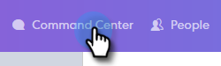
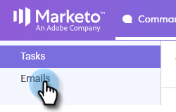
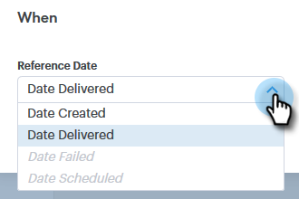
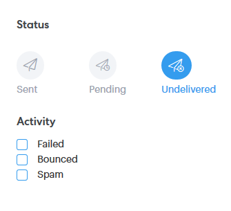

# Aperçu de la recherche avancée {#advanced-search-overview}

En utilisant la recherche avancée pour les prospects de cible qui ont consulté, cliqué ou répondu aux courriels, vous pouvez créer une liste ciblée de vos prospects les plus actives.

## Accès à la recherche avancée {#how-to-access-advanced-search}

1. Cliquez sur **Centre de commandes**.

   

1. Cliquez sur **Courriels**.

   

1. Sélectionnez l’onglet approprié.

   

1. Cliquez sur **Recherche avancée**.

   

## Filtres {#filters}

**Date**

Choisissez la plage de dates de votre recherche. Les dates prédéfinies sont mises à jour en fonction de l’état du courrier électronique que vous choisissez (Envoyé, Non distribué, En attente).

**Qui**

Filtrez par destinataire/expéditeur de courriel dans la section Qui.

| **Vue en tant que** | Vous pouvez filtrer selon un expéditeur spécifique dans votre instance de connexion commerciale (cette option est disponible pour les administrateurs uniquement). |
|---|---|
| **Par groupe** | Filtrez les courriers électroniques selon un groupe spécifique de destinataires. |
| **Par personne** | Filtrer selon un destinataire spécifique. |

**Lorsque**

Choisissez par date de création, date de livraison, date d’échec ou date planifiée. Les options disponibles varient en fonction de l’état du courrier électronique que vous choisissez (Envoyé, Non distribué, En attente).

**Campagnes**

Filtrez les courriers électroniques par participation à la campagne.

**Statut**

Vous avez le choix entre trois états de courriel. Les options de type/d’activité changent en fonction de l’état sélectionné.

***État : Envoyé***

Filtres par votre activité de courriel envoyée. Vous pouvez choisir vues/aucune vue, clics/aucun clic et/ou réponses/aucune réponse.

***État : En attente***

Filtres par tous les courriers électroniques en attente.

| **Programmé** | Courriers électroniques planifiés à partir de la fenêtre de composition (Salesforce ou l’application Web), de modules externes de messagerie ou d’une campagne. |
|---|---|
| **Versions préliminaires** | Courriers électroniques actuellement en état de brouillon. Pour être enregistré en tant que brouillon, les courriers électroniques doivent comporter un objet et un destinataire. |
| **En cours** | Courriers électroniques en cours d’envoi. Les courriels ne doivent pas rester dans cet état pendant plus de quelques secondes. |

***État : Non remis***

Filtres par courriers électroniques qui n’ont jamais été remis.

| **Échec** | Lorsqu&#39;un courrier électronique ne parvient pas à être envoyé à partir de Sales Connect (les raisons courantes sont les suivantes : e-mails envoyés à des contacts désabonnés/bloqués, ou en cas de problème lors de l’remplissage des champs dynamiques). |
|---|---|
| **Bascule** | Un courrier électronique est signalé comme rebondi lorsqu’il est rejeté par le serveur de destinataires. Seuls les courriers électroniques envoyés via les serveurs Sales Connect s&#39;affichent ici. |
| **Indésirable** | Lorsque le courrier électronique a été signalé comme indésirable (terme courant pour &quot;courrier électronique non sollicité&quot;) par le destinataire. Seuls les courriers électroniques envoyés via les serveurs Sales Connect s&#39;affichent ici. |

## Recherches enregistrées {#saved-searches}

Voici comment créer une recherche enregistrée.

1. Une fois tous vos filtres en place, cliquez sur **Enregistrer les Filtres sous**.

   

1. Attribuez un nom à votre recherche et cliquez sur **Enregistrer**.

   

   Vos recherches enregistrées se trouveront dans la barre latérale à gauche.

   

