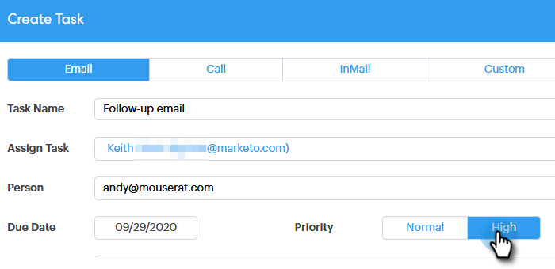

# Affectation de tâches à des personnes membres de l’équipe {#assigning-tasks-to-team-members}

Si vous souhaitez collaborer avec d’autres membres de l’équipe, l’affectation de tâches peut être un excellent moyen de coordonner vos efforts de prospection.

>[!NOTE]
>
>Vous pouvez uniquement affecter des tâches aux contacts partagés.

1. Cliquez sur le **[!UICONTROL Centre de commande]**.

   

1. Cliquez sur **[!UICONTROL Ajouter une tâche]**.

   

1. Sélectionnez le type de tâche.

   

1. Donnez un nom à votre tâche.

   

1. Sélectionnez la personne de votre équipe à laquelle vous souhaitez affecter la tâche dans le champ **[!UICONTROL Affecter une tâche]**.

   

1. Ajoutez la personne à qui vous souhaitez tendre la main dans le champ Personne .

   

1. Sélectionnez la **[!UICONTROL Date d’échéance]**.

   

1. Définissez la **[!UICONTROL Priorité]**.

   

1. Ajoutez tous les détails importants pertinents pour votre coéquipier (facultatif), puis cliquez sur **[!UICONTROL Créer]**.

   
