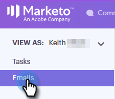

# Colonnes de courriel et mise en page de la page de courriel {#email-columns-and-email-page-layout}

Vous pouvez configurer n&#39;importe quelle colonne disponible pour qu&#39;elle soit visible dans la section Courriel du Centre de commandes. Vos paramètres de configuration seront enregistrés pour chaque sous-dossier de courrier électronique (par exemple, Livré, Echec, Planifié, etc.).

## Colonnes de courriel {#email-columns}

<table> 
 <colgroup> 
  <col> 
  <col> 
 </colgroup> 
 <tbody> 
  <tr> 
   <th>
Colonne
</th> 
   <th>Description</th> 
  </tr> 
  <tr> 
   <td>Personne</td> 
   <td>Nom et adresse électronique de la personne dans Sales Connect. Cliquez sur ce champ pour ouvrir l’onglet A propos de dans la vue des détails de la personne.</td> 
  </tr> 
  <tr> 
   <td>Nom</td> 
   <td>Nom de la personne dans Sales Connect.</td> 
  </tr> 
  <tr> 
   <td>Adresse</td> 
   <td>Adresse électronique Principal de la personne dans Sales Connect.</td> 
  </tr> 
  <tr> 
   <td>Campaign</td> 
   <td>Si le courrier électronique a été envoyé dans le cadre d’une campagne, le nom de la campagne s’affiche. Cliquez sur ce champ pour accéder à la page de configuration de cette campagne.</td> 
  </tr> 
  <tr> 
   <td>Modèle</td> 
   <td>Affiche le nom du modèle (si le courrier électronique a été envoyé avec un modèle).</td> 
  </tr> 
  <tr> 
   <td colspan="1">Objet</td> 
   <td colspan="1">Objet de la ligne du courrier électronique.</td> 
  </tr> 
  <tr> 
   <td colspan="1">Groupes</td> 
   <td colspan="1">Affiche les groupes auxquels appartient le destinataire électronique.</td> 
  </tr> 
  <tr> 
   <td>Titre de la tâche</td> 
   <td>Titre du destinataire de messagerie.</td> 
  </tr> 
  <tr> 
   <td>Société</td> 
   <td>Société du destinataire de messagerie.</td> 
  </tr> 
  <tr> 
   <td>État du courriel</td> 
   <td>Statut dans lequel se trouve le courrier électronique. Les états comprennent : Brouillon, Programmé, En Cours, Indésirable, Refusé, Échec, Envoyé. Les courriers électroniques envoyés affichent un flux d’activité qui indique le nombre de vues, de clics et de réponses qui ont eu lieu sur ce courrier électronique.</td> 
  </tr> 
  <tr> 
   <td>Date de création</td> 
   <td>Date de création du courrier électronique.</td> 
  </tr> 
  <tr> 
   <td>Dernière mise à jour</td> 
   <td>Date de la dernière mise à jour du courrier électronique.</td> 
  </tr> 
  <tr> 
   <td>Canal diffusion</td> 
   <td>Nom du canal de diffusion utilisé pour l’envoi du courrier électronique.</td> 
  </tr> 
  <tr> 
   <td>Dernière Activité</td> 
   <td>Dernier engagement du destinataire de messagerie (vue, clic ou réponse, par exemple).</td> 
  </tr> 
  <tr> 
   <td>Date d'envoi</td> 
   <td>Date d'envoi du courrier électronique.</td> 
  </tr> 
  <tr> 
   <td>Actions de suivi</td> 
   <td>Boutons d’action rapide qui peuvent être utilisés pour le suivi par courriel, téléphone, messagerie ou tâche.</td> 
  </tr> 
  <tr> 
   <td>Courriel du groupe</td> 
   <td>Affiche une coche si le courrier électronique a été envoyé dans le cadre d’un courrier électronique de groupe.</td> 
  </tr> 
  <tr> 
   <td>Date d'échéance de la tâche</td> 
   <td>Affiche la date d'échéance des tâches liées au courrier électronique. Les tâches peuvent être liées à un courrier électronique en étant créées à partir des boutons d’action rapide de la liste électronique.</td> 
  </tr> 
  <tr> 
   <td>Action Courrier électronique</td> 
   <td>Boutons d’action rapide permettant d’agir sur le courrier électronique. Selon l’état du courrier électronique, les actions suivantes peuvent être disponibles : Archiver, Réussite, Supprimer, Réessayer Envoyer, Désarchiver.</td> 
  </tr> 
  <tr> 
   <td>Type de tâche</td> 
   <td>Affiche le type de tâche d’une tâche liée au courrier électronique. Les tâches peuvent être liées à un courrier électronique en étant créées à partir des boutons d’action rapide de la liste électronique.</td> 
  </tr> 
  <tr> 
   <td>Échec de la date</td> 
   <td>Affiche la date d’échec du courrier électronique si celui-ci n’a pas été remis.</td> 
  </tr> 
 </tbody> 
</table>

## Paramètres de mise en page de la page de courriel {#email-page-layout-settings}

Vous pouvez configurer votre mise en page en procédant comme suit.

1. Accédez au Centre de commandes.

   

1. Sélectionnez la section **Courriers électroniques**.

   

1. Cliquez sur le bouton de configuration. Vos options sont les suivantes : choix du nombre de lignes à afficher, sélection des champs à afficher et sélection si vous souhaitez que les courriers électroniques de groupe soient regroupés en un seul élément de la grille (ou si vous souhaitez que tous les messages qui font partie d&#39;une grille de courriel s&#39;affichent en un seul élément).

   

1. Il vous suffit de cliquer en dehors de la configuration lorsque vous avez terminé.

