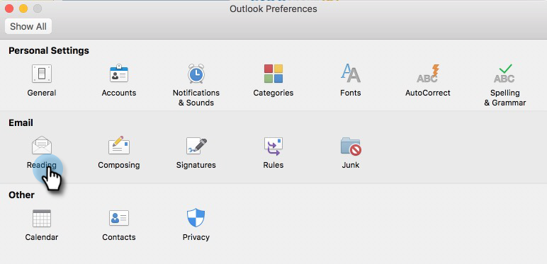

# Prévention des Vues personnelles {#preventing-self-views}

## Aperçu {#overview}

L’obtention de faux positifs sur le suivi des vues peut entraîner des incohérences de rapports. Cela se produit souvent lorsque les utilisateurs du SMC invoquent accidentellement le pixel de suivi à partir de leur client de messagerie (nous appelons cela une vue automatique). Vous trouverez ci-dessous quelques conseils sur la réduction et même l&#39;élimination des vues autonomes.

## Web (Outlook Web App et Gmail) {#web-outlook-web-app-and-gmail}

Sales Connect stockera un cookie dans votre navigateur afin d&#39;empêcher le suivi des vues lors de l&#39;ouverture de vos courriels à partir d&#39;Outlook Web App et de Gmail. Si vous recevez toujours des vues personnelles, nous vous recommandons de procéder comme suit :

* Assurez-vous que les cookies sont activés sur votre ordinateur.

* Si vous utilisez un nouvel ordinateur ou périphérique mobile, assurez-vous que vous êtes connecté à l’application Web. Cela nous permettra de reconnaître votre ordinateur ou votre périphérique à l&#39;avenir.

## Bureau (Windows) {#desktop-windows}

Le suivi des vues s’effectue en téléchargeant un petit pixel d’image invisible dans votre client de messagerie. Vous pouvez réduire de manière significative le nombre d&#39;auto-vues dans Outlook en désactivant les images à télécharger automatiquement. Voici les étapes à suivre.

1. Dans Outlook, cliquez sur **Fichier** dans la barre de menus.

   

1. Cliquez sur **Options**.

   

1. Dans la boîte de dialogue Options Outlook, cliquez sur **Centre de gestion de la confidentialité**.

   

1. Sous Centre de gestion de la confidentialité Microsoft Outlook, cliquez sur **Paramètres du Centre de gestion de la confidentialité**.

   

1. Cliquez sur Téléchargement automatique dans le menu de gauche, puis cochez la case **Ne pas télécharger automatiquement les images dans les courriels HTML ou les éléments RSS**.

   

1. Cliquez sur **OK** dans la boîte de dialogue Centre de gestion de la confidentialité.

   

1. Cliquez sur **OK** dans la boîte de dialogue Options Outlook.

   

## Bureau (Mac) {#desktop-mac}

Le suivi des vues s’effectue en téléchargeant un petit pixel d’image invisible dans votre client de messagerie. Vous pouvez réduire de manière significative le nombre d&#39;auto-vues dans Outlook en désactivant les images à télécharger automatiquement. Voici les étapes à suivre.

1. Dans Outlook, cliquez sur **Outlook** dans la barre de menus et sélectionnez **Préférences**.

   

1. Sous Courriel, sélectionnez **Lecture**.

   

1. Sous Sécurité, cliquez sur le bouton radio **Jamais**.

   

