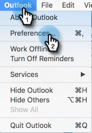

# Prévention des auto-vues {#preventing-self-views}

## Vue d’ensemble {#overview}

L’obtention de faux positifs sur votre suivi des vues peut entraîner des incohérences dans les rapports. Cela se produit souvent lorsque les utilisateurs de MSC invoquent accidentellement le pixel de suivi depuis leur client de messagerie (nous appelons cela une auto-visualisation). Vous trouverez ci-dessous quelques conseils pour réduire et même éliminer de manière significative les auto-visions.

## Web (Outlook Web App et Gmail) {#web-outlook-web-app-and-gmail}

Sales Connect stocke un cookie dans votre navigateur afin d’empêcher le suivi des vues lors de l’ouverture de vos emails à partir d’Outlook Web App et de Gmail. Si vous recevez toujours des vues d’ensemble, nous vous recommandons de procéder comme suit :

* Vérifiez que les cookies sont activés sur votre ordinateur.

* Si vous utilisez un nouvel ordinateur ou un nouvel appareil mobile, vérifiez que vous êtes connecté à l’application web. Cela nous permettra de reconnaître votre ordinateur/appareil à l’avenir.

## Bureau (Windows) {#desktop-windows}

Les vues sont suivies en téléchargeant un petit pixel d’image invisible dans votre client de messagerie. Vous pouvez réduire considérablement le nombre d’auto-vues dans Outlook en désactivant les images à télécharger automatiquement. Vous trouverez ci-dessous les étapes à suivre.

1. Dans Outlook, cliquez sur **Fichier** dans la barre de menus.

   

1. Cliquez sur **Options**.

   

1. Dans la boîte de dialogue Options Outlook, cliquez sur **Centre de gestion de la confidentialité**.

   

1. Sous Microsoft Outlook Trust Center, cliquez sur **Paramètres du Centre de gestion de la confidentialité**.

   

1. Cliquez sur Téléchargement automatique dans le menu de gauche, puis cochez la case **Ne pas télécharger automatiquement d’images dans un email d’HTML ou des éléments RSS** .

   

1. Cliquez sur **OK** dans la boîte de dialogue Centre de gestion de la confidentialité.

   

1. Cliquez sur **OK** dans la boîte de dialogue Options Outlook.

   

## Bureau (Mac) {#desktop-mac}

Les vues sont suivies en téléchargeant un petit pixel d’image invisible dans votre client de messagerie. Vous pouvez réduire considérablement le nombre d’auto-vues dans Outlook en désactivant les images à télécharger automatiquement. Vous trouverez ci-dessous les étapes à suivre.

1. Dans Outlook, cliquez sur **Outlook** dans la barre de menus et sélectionnez **Préférences**.

   

1. Sous Email, sélectionnez **Lecture**.

   

1. Sous Sécurité, cliquez sur le bouton radio **Never** .

   
