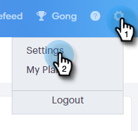

# Limitation de la connexion des e-mails {#email-connection-throttling}

L’intégration de votre compte [!DNL Sales Connect] à envoyer par l’intermédiaire de fournisseurs de messagerie [!DNL Exchange] ou Gmail offre une configuration rationalisée et optimise la délivrabilité des e-mails pour la communication commerciale 1:1. Toutefois, pour préserver la santé des systèmes et la sécurité des comptes, Gmail et Exchange appliquent des limites d’envoi d’e-mails. Ces limites peuvent être augmentées ou réduites à la discrétion des fournisseurs.

## Vue d’ensemble {#overview}

L’option Limitation de la connexion aux e-mails permet aux administrateurs [!DNL Sales Connect] de configurer le taux d’envoi des e-mails lors de l’utilisation de Gmail ou [!DNL Exchange] comme canal de diffusion, de sorte que le taux de transmission des e-mails au fournisseur de canal de diffusion ne dépasse pas les limites appliquées.

Lorsque les limites sont systématiquement dépassées, cela peut parfois être considéré comme un comportement suspect de la part du fournisseur du canal de diffusion, entraînant l’échec des e-mails et parfois même la désactivation d’un compte.

**Notes/Points forts**

* Activé automatiquement une fois qu’un utilisateur se connecte à Gmail ou [!DNL Exchange]
* Peut être personnalisé si vous souhaitez augmenter ou diminuer les paramètres de la recommandation pour répondre à vos besoins
* Ralentit uniquement les e-mails envoyés via Gmail ou [!DNL Exchange], ne ralentit pas le canal de diffusion personnalisé
* Le contrôle de la connexion aux e-mails place chaque utilisateur dans une file d’attente distincte pour les e-mails, car chaque utilisateur possède sa propre connexion avec son fournisseur de messagerie

**Configuration des paramètres de limitation de la connexion aux e-mails**

1. Cliquez sur l’icône d’engrenage et sélectionnez **[!UICONTROL Paramètres]**.

   

1. Cliquez sur **[!UICONTROL Général]**.

   

1. Dans la carte Limitation de la connexion aux e-mails , saisissez la taille de lot souhaitée des e-mails qui seront envoyés au fournisseur de canal de messagerie.

   

1. Définissez la durée d’attente avant l’envoi de chaque lot. Dans cet exemple, nous choisissons 25 e-mails toutes les 45 secondes.

   

1. Cliquez sur **[!UICONTROL Enregistrer]**

   

Une fois les modifications enregistrées, tous les utilisateurs verront leurs e-mails envoyés par lots à leur compte Gmail ou [!DNL Exchange] connecté pour diffusion.

## Limites du fournisseur de messagerie {#email-provider-limits}

**[!DNL Outlook 365]**

Entreprise

* 10 000 par jour
* 30 par minute
* 500 destinataires par e-mail

Vous trouverez plus d’informations [ici](https://docs.microsoft.com/en-us/office365/servicedescriptions/exchange-online-service-description/exchange-online-limits?redirectedfrom=MSDN#RecipientLimits).

**Gmail**

* 2000 par jour (500 pour les comptes d&#39;essai et les comptes marqués)
* 2 e-mails par seconde (limite API)
* 2 000 destinataires par message (maximum de 500 pour les destinataires externes)

Vous trouverez plus d’informations [ici](https://support.google.com/a/answer/166852?hl=en).

**[!DNL Microsoft Exchange Server (2010, 2013)]**

Les limites sont définies par le service informatique de l’organisation, car le serveur est hébergé par l’organisation. Contactez l’administrateur réseau ou système, le cas échéant, pour plus d’informations.

>[!MORELIKETHIS]
>
>* [Présentation du canal de diffusion](/help/marketo/product-docs/marketo-sales-connect/email/email-delivery/delivery-channel-overview.md)
>* [Connexion par e-mail pour les utilisateurs Gmail](/help/marketo/product-docs/marketo-sales-connect/email-plugins/gmail/email-connection-for-gmail-users.md)
>* [Connexion e-mail pour [!DNL Outlook] utilisateurs](/help/marketo/product-docs/marketo-sales-connect/email-plugins/msc-for-outlook/email-connection-for-outlook-users.md)
