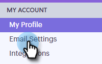

# Configurationd’ un canal de remise personnalisé {#setting-up-a-custom-delivery-channel}

[!DNL Marketo Sales Connect] vous permet de l’intégrer à un serveur SMTP personnalisé pour la diffusion de vos e-mails. Il s’agit d’une excellente option pour ceux qui ne souhaitent pas envoyer d’e-mails en masse à partir de leur canal de diffusion Gmail ou [!DNL Exchange].

Les utilisateurs peuvent configurer un serveur SMTP personnalisé pour leur propre usage individuel, ou les administrateurs peuvent configurer un serveur SMTP d’équipe à partager entre tous les utilisateurs [!DNL Sales Connect] de votre instance.

>[!NOTE]
>
>* Outre la configuration de votre serveur SMTP, votre identité [e-mail](/help/marketo/product-docs/marketo-sales-connect/getting-started/email-settings/verify-your-email.md) doit être vérifiée avant que vous puissiez envoyer des e-mails.
>* Nous vous recommandons de travailler avec votre équipe informatique ou le fournisseur du serveur SMTP pour obtenir les informations d’identification du serveur SMTP appropriées.
>* Vous ne pouvez pas connecter vos serveurs Gmail et [!DNL Exchange] à l’aide des informations d’identification du serveur SMTP. Veuillez utiliser notre service de connexion par e-mail pour l&#39;intégration avec ces fournisseurs.

## SMTP personnalisé {#custom-smtp}

1. Connectez-vous à l’[application web](https://toutapp.com/login), cliquez sur l’icône d’engrenage en haut à droite et choisissez **[!UICONTROL Paramètres]**.

   

1. Sous [!UICONTROL Mon compte], cliquez sur **[!UICONTROL Paramètres de messagerie]**.

   

1. Cliquez sur **[!UICONTROL Canal de diffusion personnalisé]**.

   

1. Saisissez vos informations d’identification [!UICONTROL Serveur SMTP] et cliquez sur **[!UICONTROL Se connecter]**.

   

   >[!NOTE]
   >
   >S’il s’agit de votre seul canal de diffusion, il est automatiquement attribué à toutes vos identités d’e-mail, et vous avez terminé ici. S’il ne s’agit pas de votre seul canal de diffusion, passez à l’étape 5.

1. Toujours dans [!UICONTROL Paramètres de messagerie], cliquez sur **[!UICONTROL Adresse et signature]**.

   

1. Recherchez l’identité e-mail pour laquelle vous souhaitez choisir un canal de diffusion et cliquez sur **[!UICONTROL Choisir un canal de diffusion]**.

   

1. Dans la carte [!UICONTROL Délivrabilité], cliquez sur **[!UICONTROL Modifier]**.

   

1. Cliquez sur le menu déroulant [!UICONTROL Canal] et sélectionnez le canal de diffusion personnalisé que vous venez d’ajouter. Cliquez sur **[!UICONTROL Enregistrer]**

   

   >[!NOTE]
   >
   >Si l’administrateur de votre équipe configure le serveur SMTP de l’équipe, il s’appliquera automatiquement uniquement à votre identité d’e-mail par défaut et sera disponible en tant qu’option pour vos autres identités d’e-mail.

## Serveur SMTP de l’équipe {#team-smtp-server}

>[!NOTE]
>
>**Autorisations d’administrateur requises**

1. Connectez-vous à l’[application web](https://toutapp.com/login), cliquez sur l’icône d’engrenage en haut à droite et choisissez **[!UICONTROL Paramètres]**.

   

1. Sous [!UICONTROL Paramètres d’administration], cliquez sur **[!UICONTROL Général]**.

   

1. Cliquez sur **[!UICONTROL Canal de diffusion de l’équipe]**.

   

1. Saisissez vos informations d’identification [!UICONTROL Serveur SMTP] et cliquez sur **[!UICONTROL Se connecter]**.

   

   >[!NOTE]
   >
   >Le serveur SMTP d&#39;équipe sera le canal de diffusion par défaut de l&#39;identité e-mail par défaut pour tous les membres de l&#39;équipe. En outre, elle sera disponible en tant qu’option de canal de diffusion pour toutes les autres identités d’e-mail.

   >[!MORELIKETHIS]
   >
   >* [Connexion par e-mail pour les utilisateurs Gmail](/help/marketo/product-docs/marketo-sales-connect/email-plugins/gmail/email-connection-for-gmail-users.md)
   >
   >* [Connexion e-mail pour [!DNL Outlook] utilisateurs](/help/marketo/product-docs/marketo-sales-connect/email-plugins/msc-for-outlook/email-connection-for-outlook-users.md)
