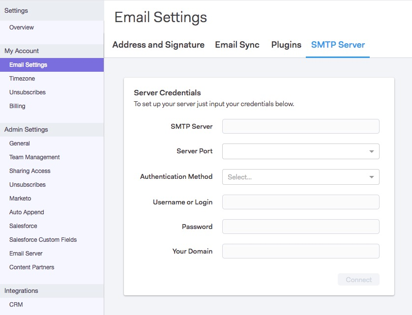

# Configuration d’un serveur SMTP {#setting-up-an-smtp-server}

## Aperçu {#overview}

**Qu’est-ce qu’un serveur SMTP ?**

**** Simple  **** Mail  ****  **** Transfer Protocol, c&#39;est le serveur responsable de l&#39;envoi de votre courrier sortant. Lorsque vous envoyez un courrier électronique à partir de votre client de messagerie, vous utilisez ce même service pour diffuser votre courrier électronique.

**Pourquoi configurer mon serveur SMTP avec Sales Connect ?**

Il vous permet d&#39;utiliser la réputation de votre domaine de société et de la délivrabilité, et de ne pas avoir à compter sur celle des autres. Nos serveurs MSC par défaut font partie d&#39;un pool IP partagé, ce qui signifie l&#39;envoi à partir d&#39;une réputation partagée. Nous vous recommandons vivement de configurer votre propre canal de diffusion avec Sales Connect.

**Comment Sales Connect envoie-t-il mon serveur SMTP ?**

En suivant [ces étapes](http://docs.marketo.com/x/ZgPh).

`<pre><em>SMTP Server Setup Page in Sales Connect</em>  </pre>` **Dois-je configurer quoi que ce soit dans mon client de messagerie ?**

En ce qui concerne un canal de diffusion, non. Une fois que vous avez installé notre module complémentaire, Sales Connect utilisera le même canal de diffusion que celui que vous avez configuré pour envoyer des courriers électroniques.

## Obtention des informations d’identification SMTP {#getting-the-smtp-credentials}

**Comment puis-je obtenir mes informations d’identification SMTP ?**

Contactez votre équipe informatique pour savoir quelle diffusion votre société utilise pour envoyer des courriers électroniques et comment accéder à vos informations d’identification SMTP. Selon la configuration de votre serveur, vous pouvez avoir des valeurs personnalisées pour le nom du serveur SMTP ou le port du serveur. Si vous ne disposez pas d’une équipe informatique dédiée, contactez votre fournisseur de messagerie.

**Quelles sont mes options si ma société utilise Office365 ?**

Avantages

* Installation facile
* Tout utilisateur disposant d&#39;un compte Office365 aura accès à ce serveur SMTP.

Cons

* Le ralentissement peut se produire.
* Chaque utilisateur doit configurer lui-même ce paramètre
* La modification du mot de passe O365 d’un utilisateur entraîne une rupture de la connexion.

Si vous utilisez Office365 ou Exchange Online, vous pouvez vous connecter à votre serveur SMTP à l’aide d’un jeu d’informations d’identification standard. N&#39;oubliez pas qu&#39;Office365 n&#39;est pas un service de diffusion de courrier électronique en masse, bien que cela fonctionne bien pour l&#39;envoi de courriers électroniques uniques. Lors de l&#39;envoi de courriers électroniques en masse, Office365 peut ralentir vos courriels, ce qui peut entraîner un échec de la diffusion. Pour en savoir plus sur cet article, consultez l&#39;article de Microsoft sur [comment configurer l&#39;envoi du client SMTP](http://support.office.com/en-us/article/how-to-set-up-a-multifunction-device-or-application-to-send-email-using-office-365-69f58e99-c550-4274-ad18-c805d654b4c4).
`<blockquote>  
“You can only send from one email address unless your device can store login credentials for multiple Office 365 mailboxes. Office 365 imposes a limit of 30 messages sent per minute, and a limit of 10,000 recipients per day.”
 </blockquote>`\
Si vous décidez d&#39;utiliser Office365 comme canal de diffusion, vous devrez entrer ces informations d&#39;identification. Les mêmes informations d&#39;identification ne peuvent pas être utilisées dans toute l&#39;équipe, car Office365 utilise le courrier électronique et le mot de passe de l&#39;utilisateur pour se connecter.

Envoi en masse et Microsoft

[Cliquez ](http://technet.microsoft.com/en-us/library/exchange-online-limits.aspx#RecipientLimits) ici pour en savoir plus sur l&#39;envoi en masse dans Office365. 
`<blockquote>  
“Exchange Online customers who need to send legitimate bulk commercial email (for example, customer newsletters) should use third-party providers that specialize in these services.”
 </blockquote>`\
**Et si ma société utilisait Gmail ?**

Vous n&#39;aurez pas besoin d&#39;obtenir d&#39;informations d&#39;identification SMTP si votre équipe souhaite utiliser Gmail comme canal de diffusion avec Sales Connect. Sales Connect permet aux utilisateurs d&#39;accéder à leur canal de diffusion Gmail via notre intégration OAuth. Les utilisateurs peuvent activer cette fonctionnalité en intégrant leur compte Sales Connect à Gmail.

**Puis-je partager les mêmes informations d’identification SMTP avec toute mon équipe ?**

Cela dépend du canal de diffusion que vous utilisez. Par exemple, les services tels que Sparkpost permettent que les informations d’identification soient basées sur un domaine. Ainsi, toute personne envoyant un domaine spécifique est authentifiée pour envoyer par ce serveur. Si c’est le cas, alors oui, vous pouvez partager les informations d’identification avec l’équipe.

Si vous vous connectez à Office365, les informations d’identification sont basées sur l’adresse électronique. Cela signifie que seule l&#39;adresse électronique qui a établi la connexion sera authentifiée pour envoyer des courriers électroniques par le biais de ce canal de diffusion, de sorte que les informations d&#39;identification doivent **ne pas** être partagées.

