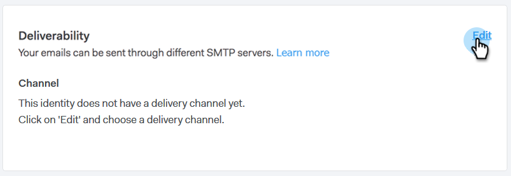

# Configuration de votre Canal de Diffusion {#setting-up-your-delivery-channel}

Lorsque vous début à utiliser Marketing Sales Connect, vous devez configurer un serveur SMTP pour envoyer des courriers électroniques.

>[!NOTE]
>
>Outre la configuration de votre serveur SMTP, votre [identité de courriel doit être vérifiée](http://docs.marketo.com/x/ewPh) avant de pouvoir envoyer des courriers électroniques.

Vous pouvez choisir d&#39;envoyer des e-mails à l&#39;aide d&#39;un serveur SMTP personnalisé, d&#39;un serveur SMTP d&#39;équipe ou de Gmail en tant que canal de diffusion. Passons en revue chaque option.

## SMTP personnalisé {#custom-smtp}

1. Connectez-vous à l’[application Web](http://toutapp.com/login), cliquez sur l’icône d’engrenage en haut à droite et choisissez **Paramètres**.

   

1. Sous Mon compte, cliquez sur **Paramètres de courriel**.

   

1. Sélectionnez **Serveur SMTP**.

   

1. Saisissez vos informations d’identification de serveur SMTP et cliquez sur **Se connecter**.

   

   >[!NOTE]
   >
   >S&#39;il s&#39;agit de votre seul canal de diffusion, il est automatiquement affecté à toutes vos identités de messagerie, et vous avez terminé ici. Si ce n&#39;est pas votre seul canal de diffusion, veuillez continuer à l&#39;étape 5.

1. Toujours dans Paramètres de courrier électronique, cliquez sur **Adresse et signature**.

   

1. Recherchez l’identité électronique pour laquelle vous souhaitez choisir un canal de diffusion et cliquez sur **Choisir le Canal de Diffusion**.

   

1. Dans la carte de délivrabilité, cliquez sur **Modifier**.

   

1. Cliquez sur la liste déroulante Canal et choisissez le canal de diffusion personnalisé que vous venez d’ajouter. Cliquez sur **Enregistrer**.

   

   >[!NOTE]
   >
   >Si l&#39;administrateur de votre équipe configure le serveur SMTP d&#39;équipe, il s&#39;appliquera automatiquement uniquement à votre identité de messagerie par défaut et sera disponible en tant qu&#39;option pour vos autres identités de messagerie.

   **Regarder une vidéo**`<iframe width="630" height="470" src="//play.vidyard.com/YWKSgZvBEjUU8FrXZ5hdYR.html?v=3.1.1" frameborder="0" allowfullscreen></iframe>`

## Team SMTP Server {#team-smtp-server}

>[!NOTE]
>
>**Autorisations d’administrateur requises**

1. Connectez-vous à l’[application Web](http://toutapp.com/login), cliquez sur l’icône d’engrenage en haut à droite et choisissez **Paramètres**.

   

1. Sous Paramètres d’administration, cliquez sur **Team SMTP Server**.

   

1. Saisissez vos informations d’identification de serveur SMTP et cliquez sur **Se connecter**.

   

   >[!NOTE]
   >
   >Le serveur SMTP d&#39;équipe sera le canal de diffusion par défaut de l&#39;identité de courriel par défaut pour tous les membres de l&#39;équipe. De plus, il sera disponible en tant qu’option de canal de diffusion pour toutes les autres identités de courriel.

   ** Regardez une vidéo**`<iframe width="630" height="470" src="//play.vidyard.com/Ky9EwGmLcgvsMpFq3H8Y6n.html?v=3.1.1" frameborder="0" allowfullscreen></iframe>`

## Gmail {#gmail}

1. Connectez-vous à l’[application Web](http://toutapp.com/login), cliquez sur l’icône d’engrenage en haut à droite et choisissez **Paramètres**.

   

1. Sous Mon compte, cliquez sur **Paramètres de courriel**.

   

1. Cliquez sur **Synchronisation des e-mails**.

   

1. Cliquez sur **Se connecter à Google**.

   

1. Connectez-vous à l’aide de vos identifiants Google.
1. Lorsque vous accédez à cet écran, cliquez sur **Autoriser**.

   

   >[!NOTE]
   >
   >S&#39;il s&#39;agit de votre seul canal de diffusion, il est automatiquement affecté à toutes vos identités de messagerie, et vous avez terminé ici. Si Gmail n&#39;est pas votre seul canal de diffusion, veuillez continuer à l&#39;étape 7.

1. Cliquez sur **Adresse et signature**.

   

1. Cliquez sur l&#39;identité du courriel pour lequel vous souhaitez que Gmail soit le canal de diffusion.

   

1. Lorsque le panneau de diapositives s&#39;ouvre, faites défiler l&#39;écran jusqu&#39;à la carte de délivrabilité.

   

1. Cliquez sur la liste déroulante Canal et choisissez le canal de diffusion Gmail que vous venez d&#39;ajouter. Cliquez sur **Enregistrer**.

   

   >[!NOTE]
   >
   >Si l&#39;administrateur de votre équipe configure le serveur SMTP d&#39;équipe, il s&#39;appliquera automatiquement uniquement à votre identité de messagerie par défaut et sera disponible en tant qu&#39;option pour vos autres identités de messagerie.

