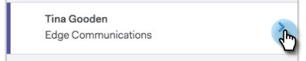

# Présentation du flux en direct {#live-feed-overview}

Le flux en direct est une fenêtre flottante qui peut être lancée à partir de l’application Web ou du module externe Gmail et offre un aperçu en temps réel de l’engagement de la prospect.

## Onglet Engagement {#engagement-tab}

Voir engagement (vues, clics et réponses) avec vos courriels MSE en temps réel.

Les personnes marquées avec du violet s’engagent dans votre contenu marketing. Il se peut que ces personnes n&#39;existent pas dans MSE. Vous pouvez cliquer sur la flèche vers le bas pour les ajouter et obtenir une liste d’autres actions rapides.

Les personnes marquées d’une ligne bleue représentent l’engagement envers les courriers électroniques envoyés via MSE.

>[!NOTE]
>
>Dans l’ensemble, nous déterminons les emplacements aussi précisément que possible en fonction du suivi IP. Malheureusement, ce n&#39;est pas une science exacte. Si l&#39;un de vos destinataires se trompe d&#39;emplacement, voici quelques options pour savoir ce qui s&#39;est passé :
>
>* Si votre destinataire était connecté au réseau sans fil pour une société qui a son siège informatique dans une autre ville ou un autre pays, nous consignerions cet emplacement au lieu du paramètre régional actuel du destinataire.
>* Si votre courrier électronique a été transféré ou ouvert par une personne dans le champ CC/BCC, nous essayons d&#39;afficher précisément l&#39;emplacement de ces personnes.

>

## Onglet tâches {#tasks-tab}

Vérifiez rapidement votre liste de tâches directement à partir du flux en direct.

Créez ou gérez des tâches ouvertes.

Filtrez aujourd&#39;hui, demain, aujourd&#39;hui *et* demain, ou les 7 prochains jours.

>[!NOTE]
>
>Vous ne pouvez pas utiliser le filtre de date personnalisé dans le flux en direct, mais vous pouvez le faire dans l’application Web.

Utilisez les boutons d’action rapide pour effectuer rapidement un appel, envoyer un courriel ou accéder au profil Linkedin d’une personne.

## Onglet cible {#target-tab}

Affichez les meilleures personnes (classées du plus haut au plus bas) classées par score de piste. Le score de piste est extrait de votre instance de marché.

* Les pistes seront générées lorsque leur score de personne augmente dans le marché.
* Nous montrons les 50 meilleures pistes.
* Vous ne verrez que les personnes qui vous ont été affectées dans Salesforce.

## Glossaire des icônes {#icon-glossary}

<table> 
 <colgroup> 
  <col> 
  <col> 
 </colgroup> 
 <tbody> 
  <tr> 
   <td> 
    
 
     

 
    
</td> 
   <td>
Quelqu'un a affiché votre e-mail
</td> 
  </tr> 
  <tr> 
   <td> 
    
 
     

 
    
</td> 
   <td>
Un utilisateur a cliqué sur un lien dans votre courrier électronique.
</td> 
  </tr> 
  <tr> 
   <td> 
    
 
     

 
    
</td> 
   <td>
Quelqu'un a répondu à votre courriel
</td> 
  </tr> 
  <tr> 
   <td colspan="1"> 
    
 
     

 
    
</td> 
   <td colspan="1">Toute notification répertoriée sous Moments intéressants, y compris Courrier électronique, Web et jalons</td> 
  </tr> 
 </tbody> 
</table>

>[!NOTE]
>
>Si vous constatez qu’une personne a vue à plusieurs reprises votre courrier électronique dans votre flux en direct, elle aurait pu le transférer à d’autres destinataires. Cela est probablement le cas si vous remarquez que le début d’emplacement change pour ces vues.

