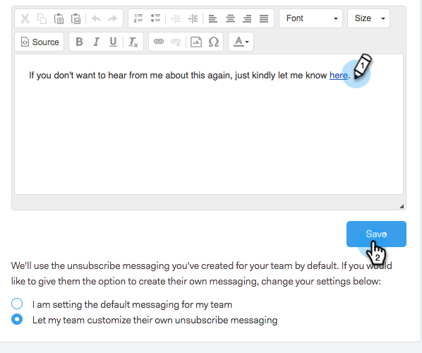

# Personnaliser le message du lien de désabonnement {#customize-unsubscribe-link-message}

Nous avons toujours permis aux équipes de personnaliser leurs messages de lien de désabonnement, mais les administrateurs peuvent désormais définir les messages de lien de désabonnement pour l’ensemble de leur équipe afin d’assurer une messagerie cohérente.

>[!NOTE]
>
>Vous ne pouvez pas utiliser un lien de désabonnement tiers avec [!DNL Sales Connect], car ces informations ne seront pas capturées dans notre base de données.

## Personnaliser les messages pour vous-même {#customize-messaging-for-yourself}

1. Connectez-vous à l’[application web](https://toutapp.com/login), cliquez sur l’icône d’engrenage en haut à droite et choisissez **[!UICONTROL Paramètres]**.

   

1. Sous [!UICONTROL  Mon compte ], sélectionnez **[!UICONTROL Désabonnements]**.

   

1. Écrivez vos messages personnalisés dans la zone de texte.

   

1. Mettez en surbrillance le texte sur lequel vous souhaitez que les personnes cliquent pour accéder à votre page de désabonnement, puis cliquez sur l’icône de lien.

   

   >[!NOTE]
   >
   >Peu importe l’URL vers laquelle pointe l’hyperlien. Lorsque l’e-mail est envoyé, ce lien hypertexte est converti en lien de désabonnement.

1. Cliquez sur **[!UICONTROL OK]**.

   

## Définir des messages de désabonnement pour votre équipe {#set-unsubscribe-messaging-for-your-team}

1. Connectez-vous à l’[application web](https://toutapp.com/login), cliquez sur l’icône d’engrenage en haut à droite et choisissez **[!UICONTROL Paramètres]**.

   

1. Sous [!UICONTROL  Paramètres d’administration ], sélectionnez **[!UICONTROL Désabonnements]**.

   

1. Personnalisez votre messagerie et cliquez sur **[!UICONTROL Enregistrer]** lorsque vous avez terminé.

   

1. Sélectionnez **[!UICONTROL Je suis en train de définir le message par défaut pour mon équipe]** pour que le message s’applique à tous les utilisateurs.

   
