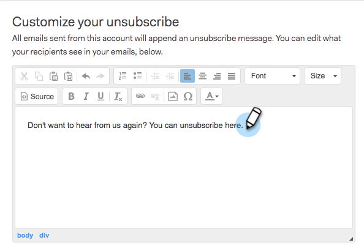

# Personnaliser le message de désabonnement de lien {#customize-unsubscribe-link-message}

Nous avons toujours permis aux équipes de personnaliser leur message de désabonnement de lien, mais les administrateurs peuvent désormais définir le message de désabonnement de lien pour l&#39;ensemble de leur équipe afin d&#39;assurer une messagerie cohérente.

>[!NOTE]
>
>Vous ne pouvez pas utiliser un lien de désabonnement tiers avec Sales Connect, car ces informations ne seront pas récupérées dans notre base de données.

## Personnaliser les messages pour vous-même {#customize-messaging-for-yourself}

1. Connectez-vous à l’application Web, cliquez sur l’icône en forme d’engrenage en haut à droite et choisissez **Paramètres**.

   

1. Sous Mon compte, sélectionnez **Désabonnement**.

   

1. Écrivez votre message personnalisé dans la zone de texte.

   

1. Mettez en surbrillance le texte sur lequel vous voulez que les utilisateurs cliquent pour accéder à votre page de désabonnement, puis cliquez sur l&#39;icône de lien.

   

   >[!NOTE]
   >
   >Peu importe l’URL à laquelle est associé un hyperlien. Lorsque le courriel est envoyé, cet hyperlien sera converti en lien de désabonnement.

1. Cliquez sur **OK**.

   

## Définir la messagerie de désabonnement pour votre équipe {#set-unsubscribe-messaging-for-your-team}

1. Connectez-vous à l’application Web, cliquez sur l’icône en forme d’engrenage en haut à droite et choisissez **Paramètres**.

   

1. Sous Paramètres d’administration, sélectionnez **Désabonnement**.

   

1. Personnalisez votre messagerie et cliquez sur **Enregistrer** lorsque vous avez terminé.

   

1. Sélectionnez **Je suis en train de définir le message par défaut de mon équipe** pour que le message s’applique à tous les utilisateurs.

   

