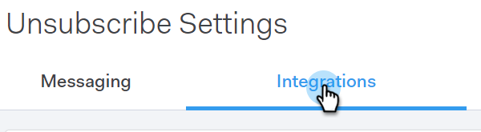

# Vérification de désabonnement du marketing {#marketo-unsubscribe-check}

La vérification de désabonnement de Marketo utilise la connexion de votre équipe à Marketo pour empêcher les courriels d&#39;être envoyés aux personnes qui ne sont pas abonnées dans le système de gestion des pistes de Marketo. Lorsqu&#39;un utilisateur commercial envoie un courrier électronique avec Sales Connect, un appel d&#39;API est envoyé à Marketing Cloud pour vérifier si l&#39;ID de courrier électronique est désabonné. Si c&#39;est le cas, nous empêcherons l&#39;envoi du courriel.

>[!NOTE]
>
>**Autorisations d’administrateur requises**

## Activation de {#turning-it-on}

1. Dans l’application Web, cliquez sur l’icône d’engrenage et sélectionnez **Paramètres**.

   

1. Sous Paramètres d’administration, cliquez sur **Désabonne**.

   

1. Cliquez sur **Intégrations**.

   

1. Dans la section Vérification de désabonnement du marketing, cliquez sur le curseur pour activer la vérification.

   

## Informations à connaître {#things-to-know}

La vérification de désabonnement de Marketo...

* Ne tient pas compte des limites de votre API
* Nécessite l&#39;établissement d&#39;une connexion Marketo
* Est un paramètre global
* Bloque les courriers électroniques envoyés à partir de l’application Web, des clients de messagerie et de Salesforce.

