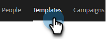

# Modèles d’e-mail de vente transactionnelle {#transactional-sales-email-templates}

Si votre équipe envoie des emails transactionnels ou non commerciaux, vous pouvez marquer un modèle d’email comme non commercial afin qu’il puisse contourner les désabonnements.

## Informations à noter {#things-to-note}

* Les emails non commerciaux contourneront les désabonnements aux ventes et [Vérification du désabonnement du Marketo Engage](/help/marketo/product-docs/marketo-sales-connect/email/unsubscribes/marketo-unsubscribe-check.md){target="_blank"}, but will not bypass [blocked domains](/help/marketo/product-docs/marketo-sales-connect/admin/blocked-domains.md){target="_blank"}.

* Les messages de désabonnement ne sont pas automatiquement ajoutés aux emails non commerciaux, même si la variable [ajout du paramètre d’administration des messages de désabonnement](/help/marketo/product-docs/marketo-sales-connect/email/unsubscribes/auto-append-unsubscribe-message-setting.md){target="_blank"} is enabled. However, the `{{team_unsubscribe}}` [dynamic field](/help/marketo/product-docs/marketo-sales-connect/templates/dynamic-fields/dynamic-fields-glossary.md){target="_blank"} renseignera toujours le message de désabonnement de votre équipe.

## Configuration d’un modèle de courrier électronique à des fins non commerciales {#configure-an-email-template-for-non-commercial-use}

1. Dans l’en-tête, cliquez sur **Modèles**.

   

1. Recherchez et sélectionnez le modèle à mettre à jour.

   

1. Activez le bouton d’activation/désactivation d’email non commercial sous Paramètres du modèle.

   

## Envoyer un email non commercial {#send-a-non-commercial-email}

>[!NOTE]
>
>Lorsqu’une personne désabonnée est sélectionnée, elle est mise en surbrillance orange.

1. Dans l’en-tête, cliquez sur **Composer**. Recherchez et sélectionnez le modèle non commercial souhaité.

   

1. Une bannière indique aux utilisateurs qu’ils ont sélectionné un modèle d’email non commercial.

   

1. Cliquez sur **Envoyer**.

   

L&#39;email sera toujours envoyé même si la personne est désinscrite.
