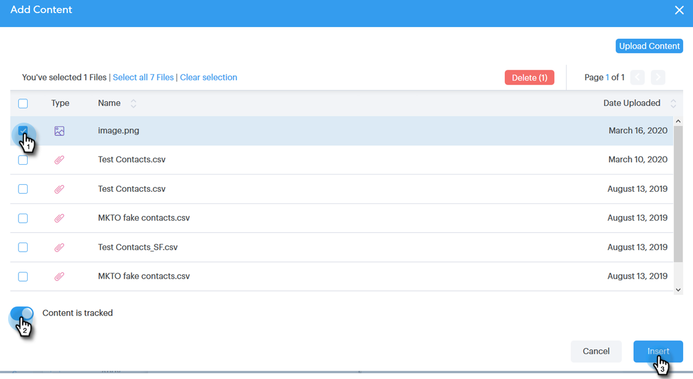

# Ajouter une pièce jointe ou un contenu pouvant faire l&#39;objet d&#39;un suivi à votre adresse électronique {#add-an-attachment-or-trackable-content-to-your-email}

Lors de l&#39;envoi d&#39;un courrier électronique via Sales Connect, vous avez la possibilité d&#39;ajouter un fichier en tant que pièce jointe ou de faire d&#39;un fichier un lien téléchargeable (et pouvant faire l&#39;objet d&#39;un suivi).

## Ajouter une pièce jointe {#add-an-attachment}

1. Créez votre brouillon de courrier électronique (il existe plusieurs façons de procéder, dans cet exemple, nous choisissons **Composer** dans l&#39;en-tête).

   

1. Renseignez le champ A et saisissez un objet.

   

1. Cliquez sur l’icône de pièce jointe.

   

1. Sélectionnez le fichier à joindre, puis cliquez sur **Insérer**.

   

   >[!NOTE]
   >
   >Si vous devez télécharger un fichier, cliquez sur le bouton **Télécharger le contenu** dans l’angle supérieur droit de la fenêtre.

   

La pièce jointe apparaît au bas de votre courrier électronique.

## Ajouter le contenu pouvant faire l&#39;objet d&#39;un suivi {#add-trackable-content}

1. Créez votre brouillon de courrier électronique (il existe plusieurs façons de procéder, dans cet exemple, nous choisissons la fenêtre Composer).

   

1. Renseignez le champ A et saisissez un objet.

   

1. Cliquez sur l’emplacement du message électronique dans lequel vous souhaitez afficher le contenu pouvant faire l’objet d’un suivi, puis cliquez sur l’icône de pièce jointe.

   

1. Sélectionnez le contenu à ajouter, cliquez sur le curseur **Contenu suivi**, puis cliquez sur **Insérer**.

   

   >[!NOTE]
   >
   >Si vous devez télécharger un fichier, cliquez sur le bouton **Télécharger le contenu** dans l’angle supérieur droit de la fenêtre.

   Le contenu s’affiche sous la forme d’un lien dans votre courrier électronique. Le destinataire peut cliquer sur le lien pour télécharger le contenu.

   

   >[!NOTE]
   >
   >Les utilisateurs seront avertis dans le flux en direct lorsque des personnes visualisent leur contenu suivi. Les utilisateurs peuvent également voir le contenu le plus performant dans la section de contenu de la page Analytics.

