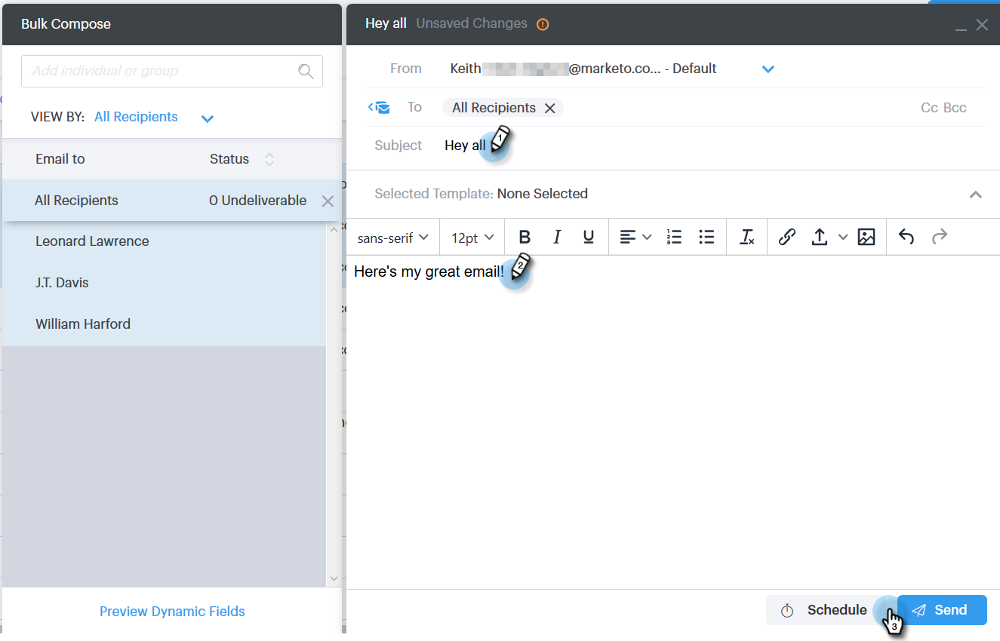

# Composition de courriels en vrac avec sélection et envoi {#composing-bulk-emails-with-select-and-send}

Voici comment envoyer/modifier des messages électroniques à l’aide de l’option Sélectionner et envoyer.

## Envoi de courriels {#sending-emails}

1. Accédez à la page Personnes.

   

1. Sélectionnez les personnes que vous souhaitez envoyer par courriel.

   

   >[!NOTE]
   >
   >Vous pouvez sélectionner jusqu’à 200 personnes lors de l’utilisation des options Sélectionner et Envoyer.

1. Cliquez sur le bouton **Envoyer la sélection** par courriel.

   

1. Entrez un objet, sélectionnez un modèle (ou composez le courriel à partir de zéro) et envoyez/ planifiez le courriel.

   

   >[!NOTE]
   >
   >Si vous avez sélectionné un modèle et souhaitez vérifier que tous les champs dynamiques sont correctement renseignés avant l’envoi, cliquez sur **Prévisualisation des champs** dynamiques. Assurez-vous que tous les destinataires de la barre latérale en bloc sont sélectionnés pour la prévisualisation de tous les courriers électroniques. Si vous sélectionnez un courriel et cliquez sur Champs **dynamiques de** Prévisualisation, seul ce courriel sera prévisualisé.

## Modification des courriels {#editing-emails}

**Modifications en masse**

1. Suivez les étapes 1 à 3 de la section Envoi de courriels.

   >[!NOTE]
   >
   >Tous les destinataires seront sélectionnés par défaut. Si vous cliquez sur un individu et souhaitez sélectionner à nouveau tout le monde, cliquez sur **Tous les Destinataires**. Pour rappel, tous les destinataires doivent être sélectionnés pour effectuer des modifications en masse.

1. Effectuez vos modifications dans l’éditeur. Vous pouvez créer un courriel ou modifier un modèle (dans cet exemple, nous créons un nouveau courriel).

   

   >[!NOTE]
   >
   >Vous pouvez cliquer sur un destinataire de messagerie spécifique pour afficher les modifications propagées à ce courriel.

1. Cliquez sur **Envoyer** (ou [Planifier](http://docs.marketo.com/x/GAQ6Ag)) pour envoyer à tous les destinataires les mises à jour par courriel en masse que vous avez effectuées.

   

**Modifier chaque courriel**

Effectuer des mises à jour en masse avant de personnaliser chaque courrier électronique, car effectuer une mise à jour en masse remplace les modifications apportées à chaque courrier électronique dans la barre latérale de composition en bloc.

1. Suivez les étapes 1 à 4 de la section [Envoi de courriels.](http://docs.marketo.com/display/DOCS/Composing+Bulk+Emails+with+Select+and+Send#ComposingBulkEmailswithSelectandSend-SendingEmails)

   >[!NOTE]
   >
   >Tous les destinataires seront sélectionnés par défaut. Si vous cliquez sur un individu et souhaitez sélectionner à nouveau tout le monde, cliquez sur **Tous les Destinataires**. Pour rappel, tous les destinataires doivent être sélectionnés pour effectuer des modifications en masse.

1. Sélectionnez un destinataire individuel.

   

1. Effectuez vos modifications dans l’éditeur.

   

   >[!NOTE]
   >
   >Vous pouvez apporter des modifications à un seul courrier électronique dans la barre latérale en bloc sans mettre à jour le reste des courriers électroniques.

   >[!TIP]
   >
   >Vous pouvez cliquer sur d’autres destinataires pour voir que les modifications que vous avez apportées au destinataire précédemment sélectionné ne s’affichent pas.

1. Cliquez sur **Envoyer** (ou [Planifier](http://docs.marketo.com/x/GAQ6Ag)) pour envoyer à tous les destinataires les mises à jour par courriel en masse que vous avez effectuées.

   

   >[!NOTE]
   >
   >**Articles connexes**
   >
   >    
   >    
   >    * [Options d&#39;envoi en masse](http://docs.marketo.com/x/HwQ6Ag)
   >    * [Utilisation d’un modèle dans la fenêtre Composer](http://docs.marketo.com/x/MQQ6Ag)
   >    * [Champs dynamiques](http://docs.marketo.com/x/wwDb)

