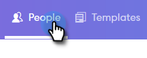

# Composition d’emails en bloc avec sélection et envoi {#composing-bulk-emails-with-select-and-send}

Voici comment envoyer/modifier des emails à l’aide de l’option Sélectionner et envoyer .

## Envoi des e-mails {#sending-emails}

1. Accédez à la page Personnes.

   

1. Sélectionnez les personnes que vous souhaitez envoyer par courrier électronique.

   

   >[!NOTE]
   >
   >Vous pouvez sélectionner 200 personnes au maximum lors de l’utilisation de l’option Sélectionner et envoyer.

1. Cliquez sur le bouton **E-mail sélectionné** .

   

1. Entrez un objet, sélectionnez un modèle (ou composez entièrement l’email) et envoyez/[planning](/help/marketo/product-docs/marketo-sales-connect/email/using-the-compose-window/scheduling-an-email.md) l’email.

   

   >[!NOTE]
   >
   >Si vous avez sélectionné un modèle et souhaitez vérifier que tous les champs dynamiques sont correctement renseignés avant l’envoi, cliquez sur **Aperçu des champs dynamiques**. Assurez-vous que tous les destinataires de la barre latérale en bloc sont sélectionnés pour la prévisualisation de tous les emails. Si vous sélectionnez un email et cliquez sur **Prévisualiser les champs dynamiques**, seul cet email sera prévisualisé.

## Modification d’emails {#editing-emails}

**Modifications en bloc**

1. Suivez les étapes 1 à 3 de la [section Envoi d’emails](#sending-emails).

   >[!NOTE]
   >
   >Tous les destinataires seront sélectionnés par défaut. Si vous cliquez sur un individu et souhaitez sélectionner à nouveau tout le monde, cliquez sur **Tous les destinataires**. Pour rappel, tous les destinataires doivent être sélectionnés pour effectuer des modifications en masse.

1. Apportez vos modifications dans l’éditeur. Vous pouvez créer un email ou éditer un modèle (dans cet exemple, nous allons créer un email).

   

   >[!NOTE]
   >
   >Vous pouvez cliquer sur un destinataire de messagerie spécifique pour afficher les modifications propagées à ce dernier.

1. Cliquez sur **Envoyer** (ou [Planning](/help/marketo/product-docs/marketo-sales-connect/email/using-the-compose-window/scheduling-an-email.md)) pour envoyer à tous les destinataires les mises à jour d&#39;email en masse que vous avez effectuées.

   

**Modifier Chaque E-Mail**

Effectuez des mises à jour en bloc avant de personnaliser chaque email, car effectuer une mise à jour en masse remplace les modifications apportées à chaque email dans la barre latérale de composition en bloc.

1. Suivez les étapes 1 à 4 de la [section Envoi d’emails](#sending-emails).

   >[!NOTE]
   >
   >Tous les destinataires seront sélectionnés par défaut. Si vous cliquez sur un individu et souhaitez sélectionner à nouveau tout le monde, cliquez sur **Tous les destinataires**. Pour rappel, tous les destinataires doivent être sélectionnés pour effectuer des modifications en masse.

1. Sélectionnez un destinataire individuel.

   

1. Apportez vos modifications dans l’éditeur.

   

   >[!NOTE]
   >
   >C’est là que vous pouvez apporter des modifications à un seul email dans la barre latérale sans mettre à jour le reste des emails.

   >[!TIP]
   >
   >Vous pouvez cliquer sur d&#39;autres destinataires pour voir que les modifications que vous avez apportées au destinataire précédemment sélectionné ne s&#39;affichent pas.

1. Cliquez sur **Envoyer** (ou [Planning](/help/marketo/product-docs/marketo-sales-connect/email/using-the-compose-window/scheduling-an-email.md)) pour envoyer à tous les destinataires les mises à jour d&#39;email en masse que vous avez effectuées.

   

   >[!MORELIKETHIS]
   >
   >* [Options d’envoi en masse](/help/marketo/product-docs/marketo-sales-connect/email/using-the-compose-window/bulk-sending-options.md)
   >* [Utilisation d’un modèle dans la fenêtre de composition](/help/marketo/product-docs/marketo-sales-connect/email/using-the-compose-window/using-a-template-in-the-compose-window.md)
   >* [Champs dynamiques](/help/marketo/product-docs/marketo-sales-connect/templates/dynamic-fields/how-to-insert-dynamic-fields.md)
